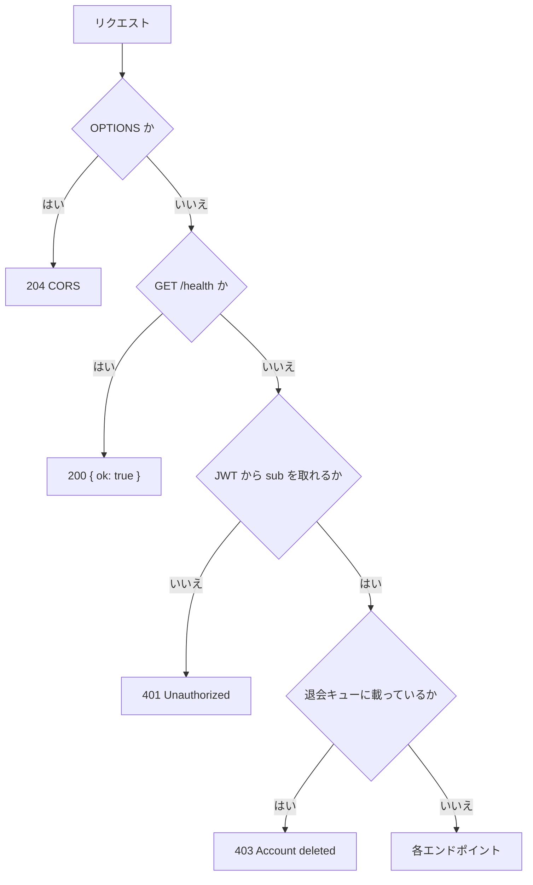
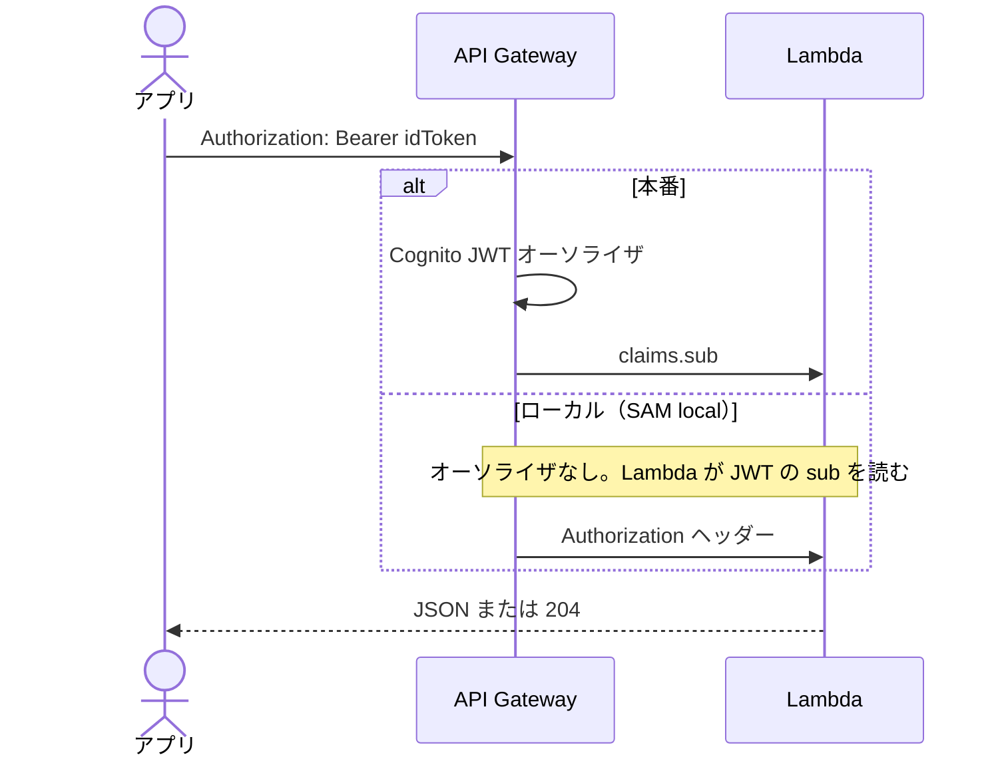
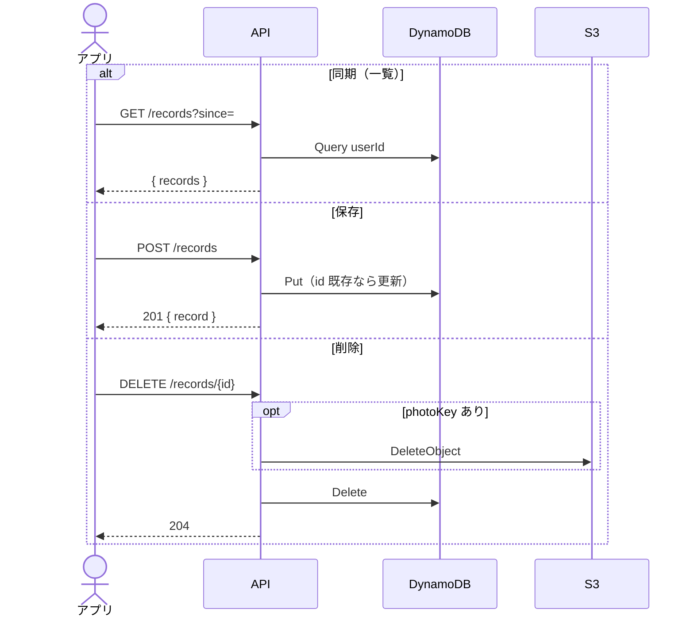
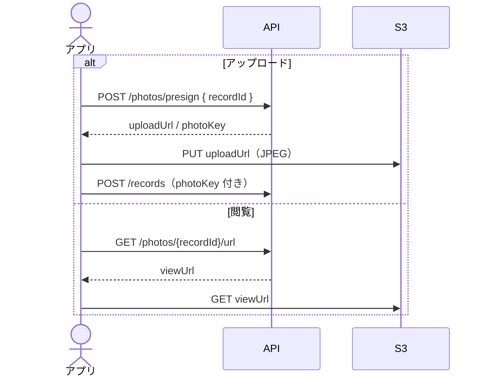
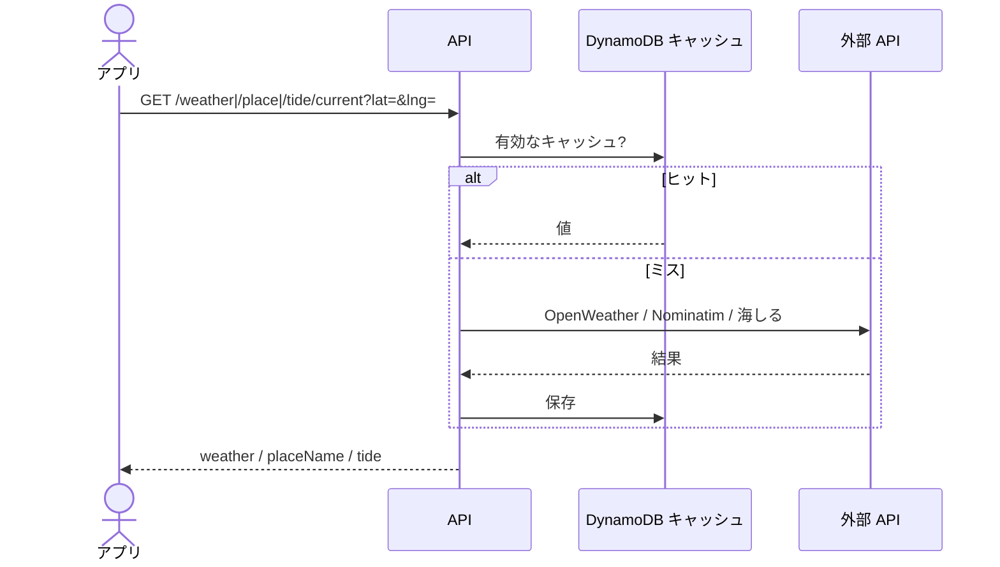
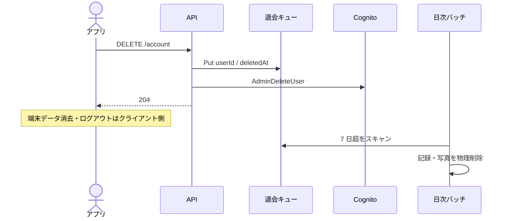

# API 設計

現行コード（`api/src/handler.ts` と `infra/template.yaml`）に基づく HTTP API。クライアントは `src/lib/api.ts`。

全体像は [API 概要](overview.md)。ベース URL は `VITE_API_URL`（本番は SAM Output `ApiUrl`）。入出力の定義は [API IF](if.md)。画面側の導線は [画面概要](../screens/overview.md) / [画面設計](../screens/design.md)、項目は [画面 IF](../screens/if.md)。

---

## 1. 認証と共通仕様

`GET /health` 以外は Cognito JWT が必要。ヘッダーは `Authorization: Bearer <idToken>`。

- 退会済みユーザー（`DELETE /account` 後）は `/health` 以外すべて 403。
- CORS は現状 `Allow-Origin: *`。許可メソッドは GET / POST / DELETE / OPTIONS。
- エラー本文は `{ "error": "..." }`。バリデーション失敗は 400、その他は 500。
- 不明なパスは 404 `{ "error": "Not found" }`。

---

## 2. エンドポイント一覧

| メソッド | パス | 認証 | 実装 | 用途 |
|---------|------|------|------|------|
| GET | `/health` | なし | `handler.ts` | ヘルスチェック |
| GET | `/records` | JWT | `records.ts` | 一覧（`?since=` で差分） |
| POST | `/records` | JWT | `records.ts` | 作成 / 更新 |
| DELETE | `/records/{id}` | JWT | `records.ts` | 削除（写真があれば S3 も） |
| POST | `/photos/presign` | JWT | `photos.ts` | アップロード用 presigned URL |
| GET | `/photos/{recordId}/url` | JWT | `photos.ts` | 閲覧用 presigned URL |
| GET | `/weather/current` | JWT | `weather.ts` | 気温・天気・風（`?lat=&lng=`） |
| GET | `/place/current` | JWT | `place.ts` | 場所名（`?lat=&lng=`） |
| GET | `/tide/current` | JWT | `tide.ts` | 天文潮位（`?lat=&lng=&at=`） |
| DELETE | `/account` | JWT | `account.ts` | 退会キュー登録 + Cognito 削除 |

HTTP に出ないバッチ: `AccountPurgeFunction`（`purgeAccounts.ts`）。退会から 7 日超の記録・写真を物理削除する。

---

## 3. 記録

自分の記録だけ見える（DynamoDB のパーティションキーは Cognito `sub`）。

### GET `/records`

| クエリ | 必須 | 内容 |
|--------|------|------|
| `since` | いいえ | ISO8601。`updatedAt`（なければ `recordedAt`）がこれより新しい件だけ返す |

応答: `{ "records": FishingRecord[] }`。新しい順。

### POST `/records`

本文は記録 1 件。同じ `id` なら上書き。`recordedAt` を変えるとソートキーも付け替える。

応答: `201 { "record": FishingRecord }`（`updatedAt` をサーバが付与）。

必須: `id`（文字列）、`recordedAt`（ISO8601）。緯度・経度は両方あるか両方ないか。`fishSizeCm` / `fishWeightG` は 0 以上。

| フィールド | 型 | 内容 |
|-----------|-----|------|
| `id` | string | クライアント生成 ID |
| `recordedAt` | string | 記録日時 |
| `latitude` / `longitude` | number \| null | 両方セットまたは両方 null |
| `locationName` | string \| null | 場所名 |
| `temperature` | number \| null | ℃ |
| `weatherCode` | number \| null | WMO 相当 |
| `windSpeedMs` | number \| null | m/s |
| `dawnAt` / `sunriseAt` / `sunsetAt` / `duskAt` | string \| null | 天文時刻 |
| `tideLevel` | number \| null | cm |
| `tideHarbor` | string \| null | 推算点名 |
| `tideCycle` / `moonPhase` | string \| null | 潮種・月相 |
| `moonAge` | number \| null | 月齢 |
| `tideSlopeCmPerHour` | number \| null | 潮位の傾き |
| `fishSpecies` | string \| null | 魚種 |
| `fishSizeCm` / `fishWeightG` | number \| null | 体長 cm / 重量 g |
| `tackle` | object \| null | `name` `rod` `reel` `line` `lureOrBait` `rig` |
| `photoKey` | string \| null | S3 キー |
| `editedFields` | string[] | `recordedAt` / `location` のみ |
| `updatedAt` | string \| null | サーバ付与。POST では無視 |

### DELETE `/records/{id}`

対象がなければ何もしない。`photoKey` があれば S3 も消す（失敗しても記録削除は続ける）。応答 204。

---

## 4. 写真

キーは `{userId}/{recordId}.jpg`。presign の有効期限は 900 秒。Content-Type は `image/jpeg`。

### POST `/photos/presign`

本文: `{ "recordId": string }`。

応答: `{ "uploadUrl": string, "photoKey": string, "expiresIn": 900 }`。

クライアントは `uploadUrl` へ PUT する（API 経由ではない）。

### GET `/photos/{recordId}/url`

応答: `{ "viewUrl": string, "expiresIn": 900 }`。

---

## 5. 天気・場所名・潮位

いずれも `lat` `lng` 必須（数値）。欠けている・非数値は 400。失敗時は画面側が null 扱い（記録自体は止めない）。

### GET `/weather/current`

OpenWeatherMap Current の Lambda プロキシ。約 1km グリッド・15 分キャッシュ。キー未設定は 500。

応答: `{ "weather": { temperature, weatherCode, windSpeedMs, time } }`。

`weatherCode` は OWM 条件 ID を WMO 相当に変換したもの。

### GET `/place/current`

Nominatim の Lambda プロキシ。約 11m グリッド・30 分キャッシュ。User-Agent にアプリ名を付ける。最短間隔約 1.1 秒。

応答: `{ "placeName": string }`。

### GET `/tide/current`

| クエリ | 必須 | 内容 |
|--------|------|------|
| `lat` / `lng` | はい | 座標 |
| `at` | いいえ | ISO8601。省略時は現在。不正なら 400 |

海しる潮汐推算 v3。最寄り推算点の日次系列をキャッシュ。キー未設定は 500。月齢・潮種は内製。

応答: `{ "tide": { levelCm, time, stationCode, stationName, distanceKm, tideCycle, moonPhase, moonAge, tideSlopeCmPerHour } }`。

---

## 6. 退会

### DELETE `/account`

1. 退会キュー（`AccountDeletionsTable`）へ `userId` を書く
2. Cognito `AdminDeleteUser`（メールを Username として使う）
3. 204

残っているトークンでは以降 403。記録・写真の物理削除は日次バッチ（既定 7 日後）。

---

## 7. ヘルスチェック

`GET /health` → `{ "ok": true }`。認証なし。デプロイ後の疎通確認と `checkApiHealth()` が使う。
