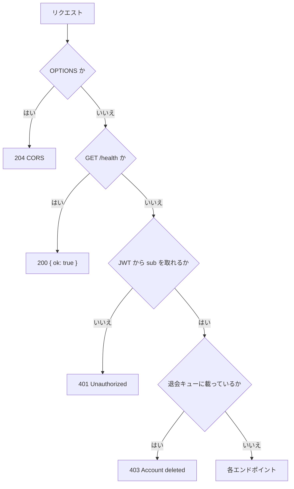
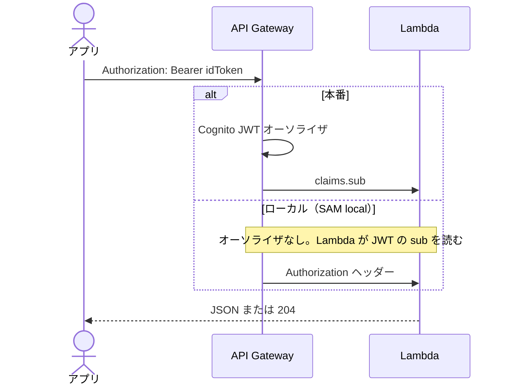

# API 設計

現行コード（`api/src/handler.ts` と `infra/template.yaml`）に基づく HTTP API。クライアントは `src/lib/api.ts`。

全体像は [API 概要](../overview.md)。ベース URL は `VITE_API_URL`（本番は SAM Output `ApiUrl`）。入出力の定義は [API IF](../if.md)。画面側の導線は [画面概要](../../screens/overview.md) / [画面設計](../../screens/design/README.md)、項目は [画面 IF](../../screens/if.md)。

| 資料 | 内容 |
|------|------|
| [認証と共通仕様](#認証と共通仕様) | JWT・CORS・エラー |
| [エンドポイント一覧](#エンドポイント一覧) | パス一覧 |
| [記録](records.md) | GET / POST / DELETE `/records` |
| [写真](photos.md) | presign / 閲覧 URL |
| [天気・場所名・潮位](weather.md) | `/weather` `/place` `/tide` |
| [退会](account.md) | DELETE `/account` と日次バッチ |
| [ヘルスチェック](#ヘルスチェック) | GET `/health` |

---

## 認証と共通仕様

`GET /health` 以外は Cognito JWT が必要。ヘッダーは `Authorization: Bearer <idToken>`。

- 退会済みユーザー（`DELETE /account` 後）は `/health` 以外すべて 403。
- CORS は現状 `Allow-Origin: *`。許可メソッドは GET / POST / DELETE / OPTIONS。
- エラー本文は `{ "error": "..." }`。バリデーション失敗は 400、その他は 500。
- 不明なパスは 404 `{ "error": "Not found" }`。

---

## エンドポイント一覧

| メソッド | パス | 認証 | 実装 | 用途 | 設計 |
|---------|------|------|------|------|------|
| GET | `/health` | なし | `handler.ts` | ヘルスチェック | [ヘルス](#ヘルスチェック) |
| GET | `/records` | JWT | `records.ts` | 一覧（`?since=` で差分） | [記録](records.md) |
| POST | `/records` | JWT | `records.ts` | 作成 / 更新 | [記録](records.md) |
| DELETE | `/records/{id}` | JWT | `records.ts` | 削除（写真があれば S3 も） | [記録](records.md) |
| POST | `/photos/presign` | JWT | `photos.ts` | アップロード用 presigned URL | [写真](photos.md) |
| GET | `/photos/{recordId}/url` | JWT | `photos.ts` | 閲覧用 presigned URL | [写真](photos.md) |
| GET | `/weather/current` | JWT | `weather.ts` | 気温・天気・風（`?lat=&lng=`） | [天気](weather.md) |
| GET | `/place/current` | JWT | `place.ts` | 場所名（`?lat=&lng=`） | [天気](weather.md) |
| GET | `/tide/current` | JWT | `tide.ts` | 天文潮位（`?lat=&lng=&at=`） | [天気](weather.md) |
| DELETE | `/account` | JWT | `account.ts` | 退会キュー登録 + Cognito 削除 | [退会](account.md) |

HTTP に出ないバッチ: `AccountPurgeFunction`（`purgeAccounts.ts`）。退会から 7 日超の記録・写真を物理削除する。詳細は [退会](account.md)。

---

## ヘルスチェック

`GET /health` → `{ "ok": true }`。認証なし。デプロイ後の疎通確認と `checkApiHealth()` が使う。
