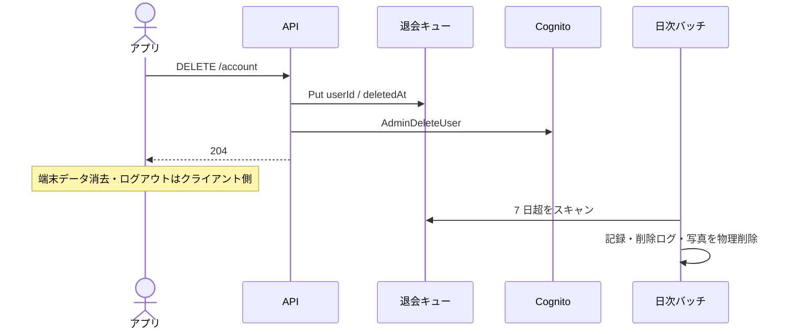

# 退会

[API 設計](README.md) / [API 概要](../overview.md) / [API IF API-10](../if.md#api-10-delete-account) / [BATCH-01](../if.md#batch-01-アカウント物理削除)

### DELETE `/account`

1. 退会キュー（`AccountDeletionsTable`）へ `userId` を書く
2. Cognito `AdminDeleteUser`（メールを Username として使う）
3. 204

残っているトークンでは以降 403。記録・写真・削除ログの物理削除は日次バッチ（既定 7 日後）。

