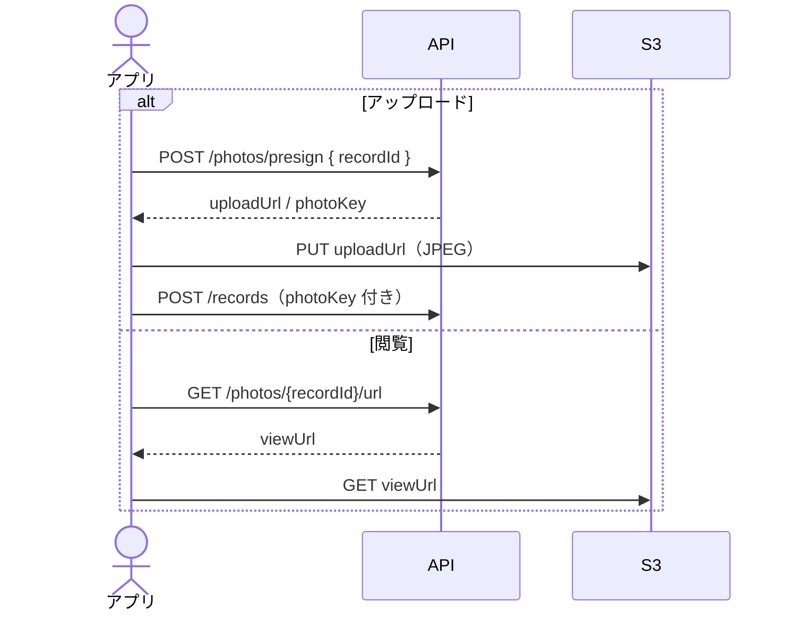

# 写真

[API 設計](README.md) / [API 概要](../overview.md) / [API IF API-05〜06](../if.md#api-05-post-photospresign)

キーは `{userId}/{recordId}.jpg`。presign の有効期限は 900 秒。Content-Type は `image/jpeg`。

### POST `/photos/presign`

本文: `{ "recordId": string }`。

応答: `{ "uploadUrl": string, "photoKey": string, "expiresIn": 900 }`。

クライアントは `uploadUrl` へ PUT する（API 経由ではない）。

### GET `/photos/{recordId}/url`

応答: `{ "viewUrl": string, "expiresIn": 900 }`。

