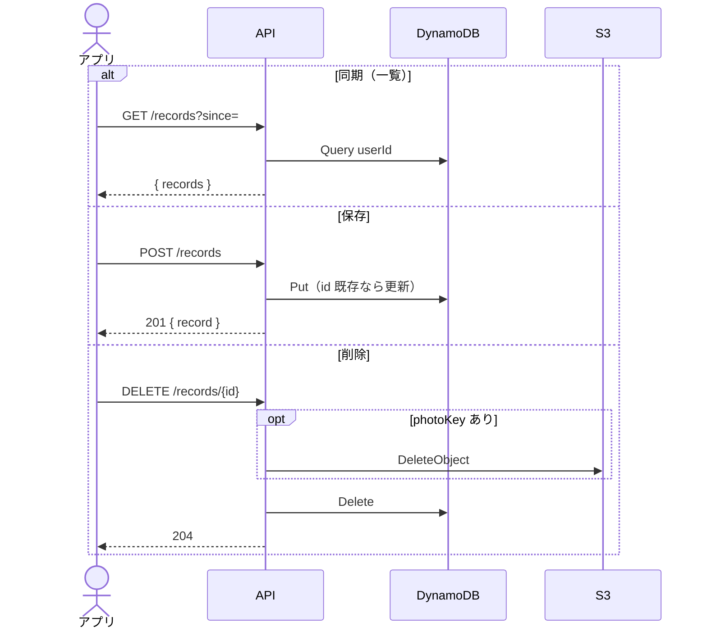

# 記録

[API 設計](README.md) / [API 概要](../overview.md) / [API IF API-02〜04](../if.md#api-02-get-records)

自分の記録だけ見える（DynamoDB のパーティションキーは Cognito `sub`）。

### GET `/records`

| クエリ | 必須 | 内容 |
|--------|------|------|
| `since` | いいえ | ISO8601。`updatedAt`（なければ `recordedAt`）がこれより新しい件だけ返す |

応答: `{ "records": FishingRecord[] }`。新しい順。

### POST `/records`

本文は記録 1 件。同じ `id` なら上書き。`recordedAt` を変えるとソートキーも付け替える。

応答: `201 { "record": FishingRecord }`（`updatedAt` をサーバが付与）。

必須: `id`（文字列）、`recordedAt`（ISO8601）。緯度・経度は両方あるか両方ないか。`fishSizeCm` / `fishWeightG` は 0 以上。

| フィールド | 型 | 内容 |
|-----------|-----|------|
| `id` | string | クライアント生成 ID |
| `recordedAt` | string | 記録日時 |
| `latitude` / `longitude` | number \| null | 両方セットまたは両方 null |
| `locationName` | string \| null | 場所名 |
| `temperature` | number \| null | ℃ |
| `weatherCode` | number \| null | WMO 相当 |
| `windSpeedMs` | number \| null | m/s |
| `dawnAt` / `sunriseAt` / `sunsetAt` / `duskAt` | string \| null | 天文時刻 |
| `tideLevel` | number \| null | cm |
| `tideHarbor` | string \| null | 推算点名 |
| `tideCycle` / `moonPhase` | string \| null | 潮種・月相 |
| `moonAge` | number \| null | 月齢 |
| `tideSlopeCmPerHour` | number \| null | 潮位の傾き |
| `fishSpecies` | string \| null | 魚種 |
| `fishSizeCm` / `fishWeightG` | number \| null | 体長 cm / 重量 g |
| `tackle` | object \| null | `name` `rod` `reel` `line` `lureOrBait` `rig` |
| `photoKey` | string \| null | S3 キー |
| `editedFields` | string[] | `recordedAt` / `location` のみ |
| `updatedAt` | string \| null | サーバ付与。POST では無視 |

### DELETE `/records/{id}`

対象がなければ何もしない。`photoKey` があれば S3 も消す（失敗しても記録削除は続ける）。応答 204。

