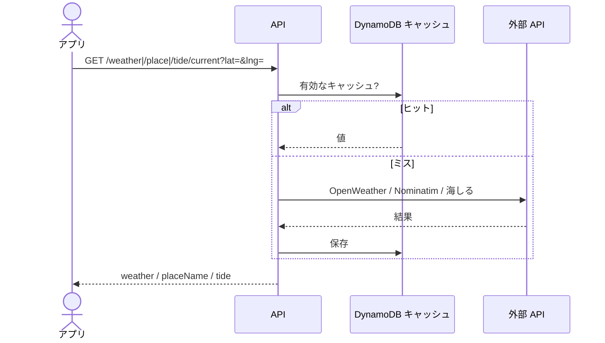

# 天気・場所名・潮位

[API 設計](README.md) / [API 概要](../overview.md) / [API IF API-07〜09](../if.md#api-07-get-weathercurrent)

いずれも `lat` `lng` 必須（数値）。欠けている・非数値は 400。失敗時は画面側が null 扱い（記録自体は止めない）。

### GET `/weather/current`

OpenWeatherMap Current の Lambda プロキシ。約 1km グリッド・15 分キャッシュ。キー未設定は 500。

応答: `{ "weather": { temperature, weatherCode, windSpeedMs, time } }`。

`weatherCode` は OWM 条件 ID を WMO 相当に変換したもの。

### GET `/place/current`

Nominatim の Lambda プロキシ。約 11m グリッド・30 分キャッシュ。User-Agent にアプリ名を付ける。最短間隔約 1.1 秒。

応答: `{ "placeName": string }`。

### GET `/tide/current`

| クエリ | 必須 | 内容 |
|--------|------|------|
| `lat` / `lng` | はい | 座標 |
| `at` | いいえ | ISO8601。省略時は現在。不正なら 400 |

海しる潮汐推算 v3。最寄り推算点の日次系列をキャッシュ。キー未設定は 500。月齢・潮種は内製。

応答: `{ "tide": { levelCm, time, stationCode, stationName, distanceKm, tideCycle, moonPhase, moonAge, tideSlopeCmPerHour } }`。

