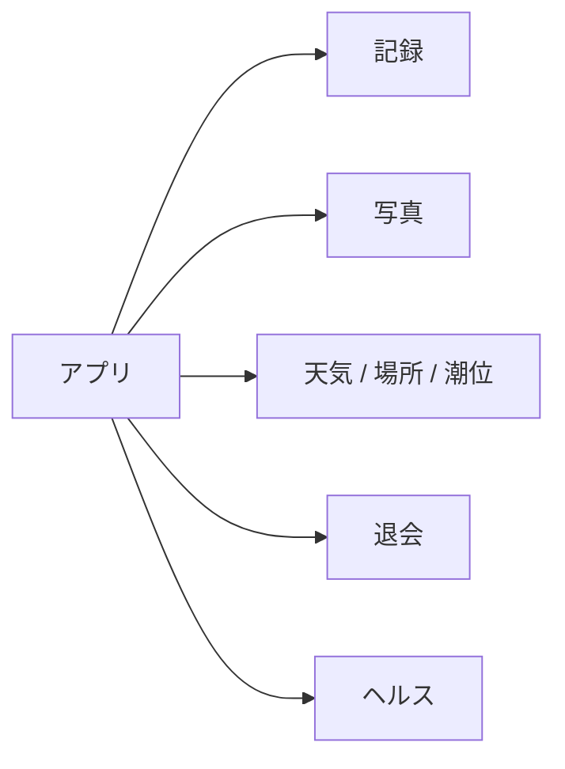

# API 概要

cast mark の HTTP API は、ログインユーザーの記録・写真の同期と、記録時に使う天気・場所名・潮位の取得、退会を担う。認証は Cognito JWT。`GET /health` だけ認証なし。

| 次に読む | 内容 |
|----------|------|
| [API 設計](design.md) | 認証・パス・処理の流れ |
| [API IF](if.md) | 入出力・ステータス・データ型・エラー |

画面の全体像は [画面概要](../screens/overview.md)。クライアントは `src/lib/api.ts`、サーバは `api/src/handler.ts`。

---

## 役割

ベース URL は `VITE_API_URL`（本番は SAM Output `ApiUrl`）。アプリは記録の正を IndexedDB に置き、オンラインかつログイン時だけこの API でクラウドと同期する。天気・場所名・潮位は Lambda が外部 API をプロキシし、取れなくても記録保存は止めない。

---

## リソース

| 領域 | 何をするか | 設計 | IF |
|------|------------|------|-----|
| 記録 | 自分の記録の一覧・作成/更新・削除 | [記録](design.md#3-記録) | [API-02〜04](if.md#api-02-get-records) |
| 写真 | アップロード / 閲覧用の presigned URL | [写真](design.md#4-写真) | [API-05〜06](if.md#api-05-post-photospresign) |
| 天気・場所・潮位 | 座標から環境データを取得（キャッシュあり） | [天気・場所名・潮位](design.md#5-天気場所名潮位) | [API-07〜09](if.md#api-07-get-weathercurrent) |
| 退会 | 即時にログイン不可。記録・写真は後から物理削除 | [退会](design.md#6-退会) | [API-10](if.md#api-10-delete-account) / [BATCH-01](if.md#batch-01-アカウント物理削除) |
| ヘルス | 疎通確認 | [ヘルスチェック](design.md#7-ヘルスチェック) | [API-01](if.md#api-01-get-health) |

エンドポイントの一覧は [API 設計 2](design.md#2-エンドポイント一覧) / [API IF 1.4](if.md#14-エンドポイント一覧)。記録の型は [FishingRecord](if.md#21-fishingrecord)。

---

## 認証

`Authorization: Bearer <idToken>`。取れなければ 401。退会済み（`DELETE /account` 後）は `/health` 以外すべて 403。

本番は API Gateway の Cognito JWT オーソライザ、ローカル（SAM local）は Lambda が JWT の `sub` を読む。記録は自分の `sub` だけ見える。

詳細: [API 設計 1. 認証と共通仕様](design.md#1-認証と共通仕様) / [API IF 1.2](if.md#12-認証)

---

## 記録

クライアント生成 ID。同じ `id` なら上書き。一覧は `?since=` で差分同期できる。削除時に写真キーがあれば S3 も消す。

画面では記録の保存・編集・履歴同期・削除が使う。

詳細: [API 設計 3](design.md#3-記録) / [API IF API-02〜04](if.md#api-02-get-records)

---

## 写真

キーは `{userId}/{recordId}.jpg`。API は URL を発行するだけで、実体の PUT / GET はクライアントが S3 へ直接行う。有効期限 900 秒、JPEG。

推奨手順: presign → S3 PUT → `POST /records`（`photoKey` 付き）。

詳細: [API 設計 4](design.md#4-写真) / [API IF 4. 写真アップロード](if.md#4-写真アップロードs3presign)

---

## 天気・場所名・潮位

いずれも `lat` `lng` 必須。欠けていれば 400。外部 API 失敗時は画面が null 扱いし、記録自体は止めない。

| パス | ソース | 画面での使い方 |
|------|--------|----------------|
| `/weather/current` | OpenWeatherMap | 新規記録の気温・天気・風 |
| `/place/current` | Nominatim | 記録・編集の場所名 |
| `/tide/current` | 海しる潮汐推算 | 記録・編集の潮位（`at` で時刻指定可） |

詳細: [API 設計 5](design.md#5-天気場所名潮位) / [API IF API-07〜09](if.md#api-07-get-weathercurrent)

---

## 退会

`DELETE /account` で退会キューへ載せ、Cognito ユーザーを消す（204）。残っているトークンでは以降 403。端末データの消去とログアウトはクライアント側。記録・写真の物理削除は日次バッチ（既定 7 日後）。

詳細: [API 設計 6](design.md#6-退会) / [API IF API-10](if.md#api-10-delete-account)
