# 画面設計

現行コード（`src/App.tsx` と各ページ）に基づく画面構成と遷移。ルート以外のオーバーレイも書く。

実装ファイルは `実装` 列に、ルートは `src/App.tsx` の定義どおり。画面のつながりはフローチャート、画面間のやり取りはシーケンス図。項目・操作は [画面 IF](if.md)。画面が叩く HTTP API は [API IF](../api/if.md) / [API 設計](../api/design.md)。

---

## 1. 画面一覧

### 1.1 ルート

| パス | 画面 | 実装 | 認証 | ボトムナビ |
|------|------|------|------|------------|
| `/` | 未ログインかつクラウド有効ならランディング。それ以外は記録 | `RootPage` → `LandingPage` / `HomePage` | 公開 | ログイン時のみ |
| `/login` | ログイン / 新規登録 / 確認コード | `LoginPage` | 公開。ログイン済みなら `/` | なし |
| `/forgot-password` | パスワード再設定 | `ForgotPasswordPage` | 公開。ログイン済みなら `/` | なし |
| `/guide` | 使い方 | `GuidePage` | 公開 | なし |
| `/privacy` | プライバシーポリシー | `LegalPage` | 公開 | なし |
| `/terms` | 利用規約 | `LegalPage` | 公開 | なし |
| `/history` | 履歴（カレンダー・地図・一覧） | `HistoryPage` | 要ログイン | あり |
| `/history/map` | `/history` へリダイレクト（旧 URL） | `HistoryMapRedirect` | 要ログイン | — |
| `/mypage` | マイページ | `MyPage` | 要ログイン | あり |
| `/mypage/tackle` | マイタックル | `MyTacklePage` | 要ログイン | あり |
| `/mypage/encyclopedia` | マイ魚種図鑑（一覧） | `FishEncyclopediaPage` | 要ログイン | あり |
| `/mypage/encyclopedia/:species` | 魚種詳細 | `FishEncyclopediaSpeciesPage` | 要ログイン | あり |
| `/mypage/email` | メールアドレス変更 | `ChangeEmailPage` | 要ログイン・クラウド必須 | あり |
| `/mypage/password` | パスワード変更 | `ChangePasswordPage` | 要ログイン・クラウド必須 | あり |
| `/mypage/delete-account` | 退会 | `DeleteAccountPage` | 要ログイン・クラウド必須 | あり |

公開コンテンツ（`/guide` `/privacy` `/terms`）では、ログイン中でもボトムナビと同期バナーを出さない。

### 1.2 ルートではない UI

| UI | 出る場所 | 内容 |
|----|----------|------|
| 同期バナー | ログイン中の非公開画面 | メール表示とログアウト |
| ボトムナビ | ログイン中の非公開画面 | 記録 / 履歴 / マイページ |
| タックル入力パネル | 記録 | 開閉。マイタックルの呼び出し・保存 |
| 記録進捗・保存サマリー | 記録 | 「記録する」後 |
| 記録詳細シート | 履歴・魚種詳細 | 閲覧 / スワイプ切替 / 編集 / 削除確認 |
| 座標ピッカー地図 | 記録詳細シートの編集 | 位置の指定し直し |

---

## 2. 認証ゲート

クラウド同期の有無（Cognito 設定の有無）でルートの出し分けが変わる。

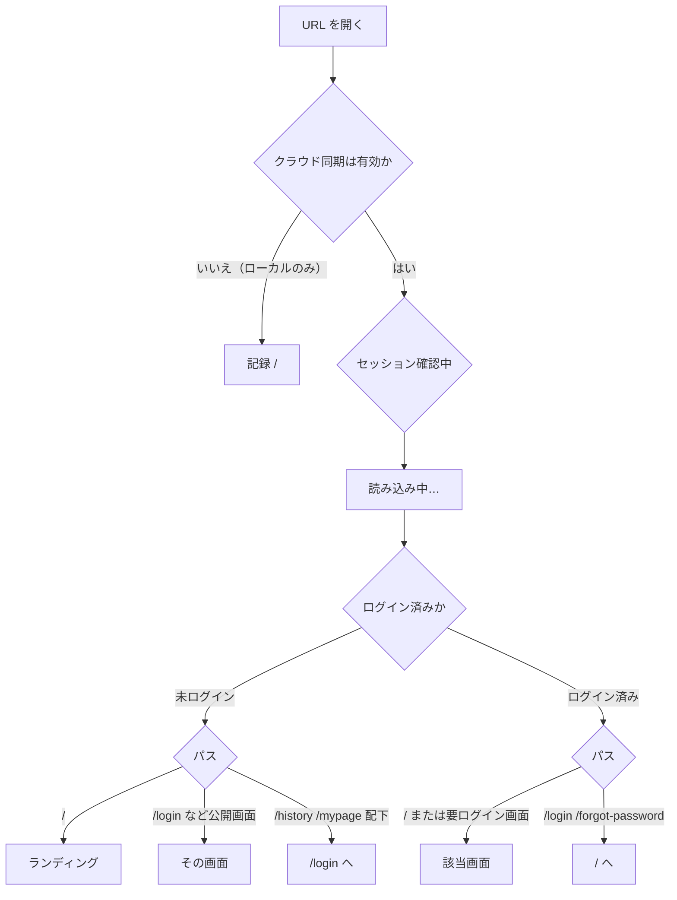
```mermaid
flowchart TD
  start["URL を開く"] --> cloud{"クラウド同期は有効か"}

  cloud -->|"いいえ（ローカルのみ）"| localHome["記録 /"]
  cloud -->|"はい"| loading{"セッション確認中"}
  loading --> wait["読み込み中…"]
  wait --> auth{"ログイン済みか"}

  auth -->|"未ログイン"| publicPath{"パス"}
  publicPath -->|"/"| landing["ランディング"]
  publicPath -->|"/login など公開画面"| publicPage["その画面"]
  publicPath -->|"/history /mypage 配下"| toLogin["/login へ"]

  auth -->|"ログイン済み"| authedPath{"パス"}
  authedPath -->|"/ または要ログイン画面"| app["該当画面"]
  authedPath -->|"/login /forgot-password"| toRoot["/ へ"]
```

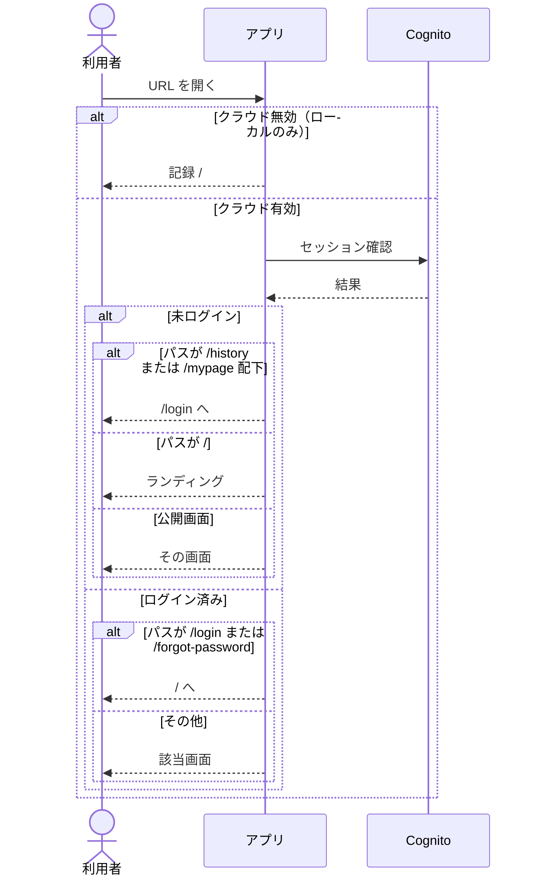
```mermaid
sequenceDiagram
  actor U as 利用者
  participant App as アプリ
  participant Auth as Cognito

  U->>App: URL を開く
  alt クラウド無効（ローカルのみ）
    App-->>U: 記録 /
  else クラウド有効
    App->>Auth: セッション確認
    Auth-->>App: 結果
    alt 未ログイン
      alt パスが /history または /mypage 配下
        App-->>U: /login へ
      else パスが /
        App-->>U: ランディング
      else 公開画面
        App-->>U: その画面
      end
    else ログイン済み
      alt パスが /login または /forgot-password
        App-->>U: / へ
      else その他
        App-->>U: 該当画面
      end
    end
  end
```

- **要ログイン**: `RequireAuth`。クラウド有効かつ未ログインなら `/login`。ローカルのみなら通す。
- **クラウド必須の下位画面**（メール変更・パスワード変更・退会）: ローカルのみなら `/mypage` へ戻す。
- ログイン済みで `/login` または `/forgot-password` を開くと `/` へ戻す。

---

## 3. 全体マップ

ログイン後の主画面と、未ログイン時の入口。

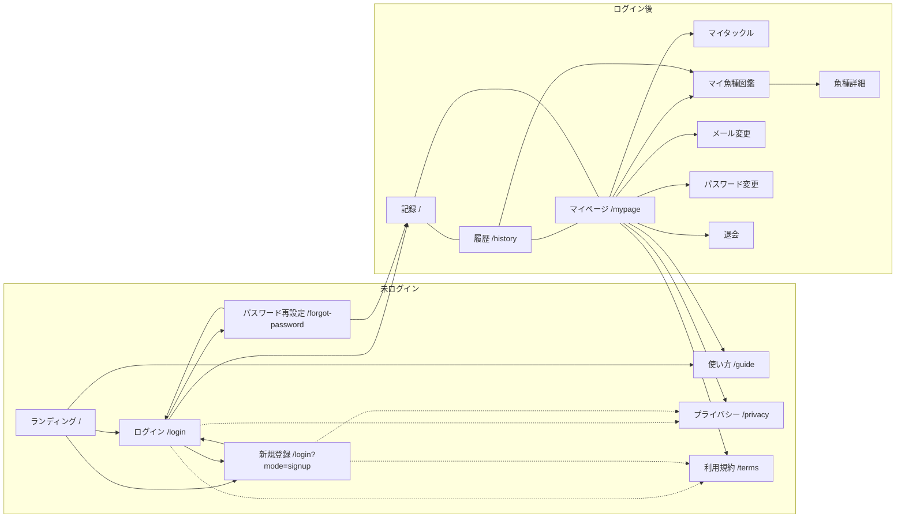
```mermaid
flowchart LR
  subgraph public ["未ログイン"]
    L["ランディング /"]
    Login["ログイン /login"]
    Signup["新規登録 /login?mode=signup"]
    Forgot["パスワード再設定 /forgot-password"]
    Guide["使い方 /guide"]
    Privacy["プライバシー /privacy"]
    Terms["利用規約 /terms"]
  end

  subgraph app ["ログイン後"]
    Record["記録 /"]
    History["履歴 /history"]
    MyPage["マイページ /mypage"]
    Tackle["マイタックル"]
    Encyclo["マイ魚種図鑑"]
    Species["魚種詳細"]
    Email["メール変更"]
    Pass["パスワード変更"]
    Delete["退会"]
  end

  L --> Login
  L --> Signup
  L --> Guide
  Login --> Signup
  Login --> Forgot
  Signup --> Login
  Forgot --> Login
  Login --> Record
  Forgot --> Record

  Record --- History
  History --- MyPage
  Record --- MyPage

  MyPage --> Tackle
  MyPage --> Encyclo
  MyPage --> Email
  MyPage --> Pass
  MyPage --> Delete
  History --> Encyclo
  Encyclo --> Species

  Login -.-> Privacy
  Login -.-> Terms
  Signup -.-> Privacy
  Signup -.-> Terms
  MyPage --> Guide
  MyPage --> Privacy
  MyPage --> Terms
```

ボトムナビは記録・履歴・マイページの 3 タブ。下位画面でも表示したまま、戻るは各画面のヘッダー。

---

## 4. 主要フロー

### 4.1 初回: ランディング → 登録 → 記録

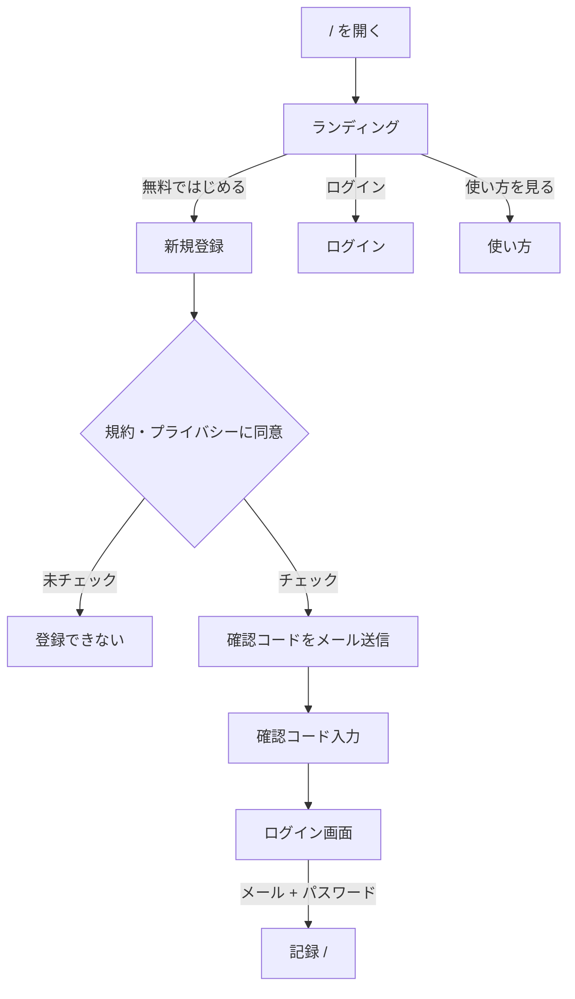
```mermaid
flowchart TD
  open["/ を開く"] --> land["ランディング"]
  land -->|"無料ではじめる"| signup["新規登録"]
  land -->|"ログイン"| login["ログイン"]
  land -->|"使い方を見る"| guide["使い方"]

  signup --> agree{"規約・プライバシーに同意"}
  agree -->|"未チェック"| stay["登録できない"]
  agree -->|"チェック"| send["確認コードをメール送信"]
  send --> confirm["確認コード入力"]
  confirm --> login2["ログイン画面"]
  login2 -->|"メール + パスワード"| home["記録 /"]
```

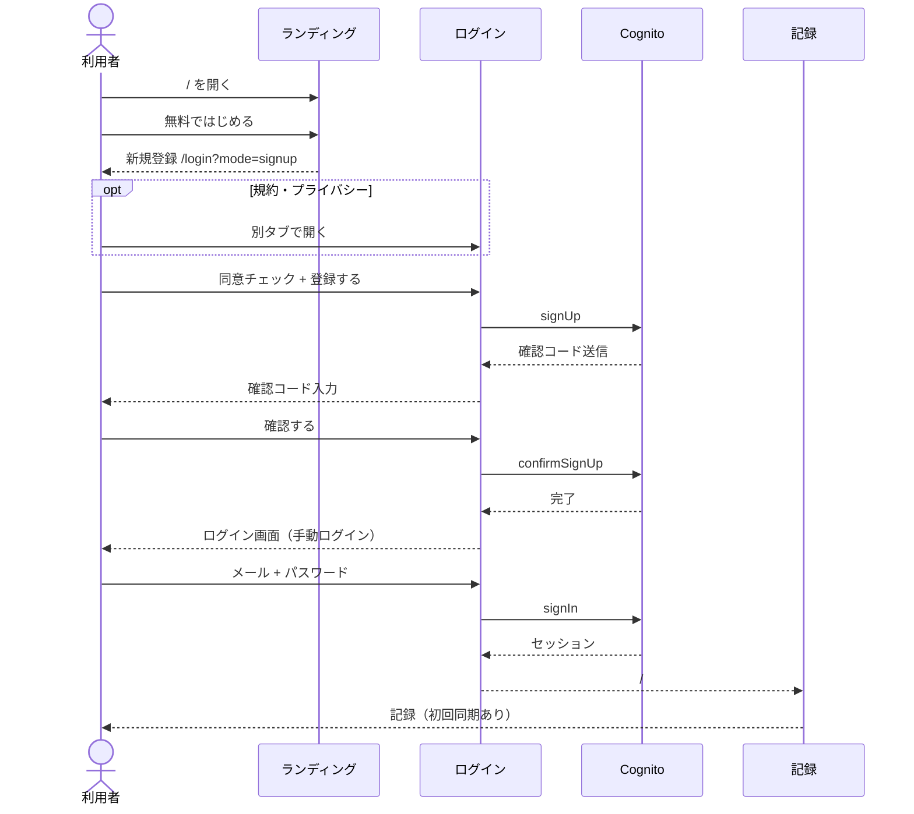
```mermaid
sequenceDiagram
  actor U as 利用者
  participant L as ランディング
  participant Login as ログイン
  participant Auth as Cognito
  participant Rec as 記録

  U->>L: / を開く
  U->>L: 無料ではじめる
  L-->>U: 新規登録 /login?mode=signup
  opt 規約・プライバシー
    U->>Login: 別タブで開く
  end
  U->>Login: 同意チェック + 登録する
  Login->>Auth: signUp
  Auth-->>Login: 確認コード送信
  Login-->>U: 確認コード入力
  U->>Login: 確認する
  Login->>Auth: confirmSignUp
  Auth-->>Login: 完了
  Login-->>U: ログイン画面（手動ログイン）
  U->>Login: メール + パスワード
  Login->>Auth: signIn
  Auth-->>Login: セッション
  Login-->>Rec: /
  Rec-->>U: 記録（初回同期あり）
```

- 新規登録は `/login?mode=signup`。規約・プライバシーは別タブで開く。
- 確認コード成功後はログイン画面に戻り、手動ログインする（自動ログインではない）。
- 登録後の初回ログインで、端末の既存記録があればクラウドへ移行する。

### 4.2 復帰: ログイン / パスワード再設定

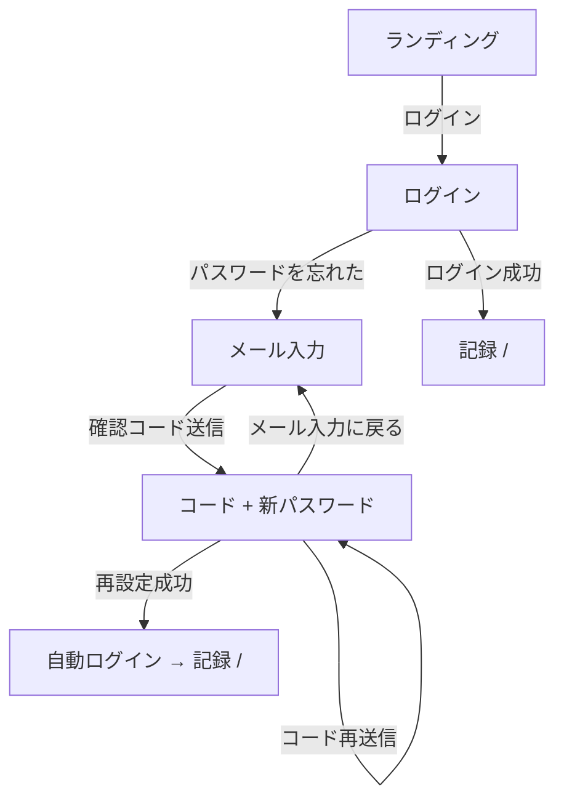
```mermaid
flowchart TD
  land["ランディング"] -->|"ログイン"| login["ログイン"]
  login -->|"パスワードを忘れた"| fp1["メール入力"]
  fp1 -->|"確認コード送信"| fp2["コード + 新パスワード"]
  fp2 -->|"再設定成功"| auto["自動ログイン → 記録 /"]
  fp2 -->|"コード再送信"| fp2
  fp2 -->|"メール入力に戻る"| fp1
  login -->|"ログイン成功"| home["記録 /"]
```

パスワード再設定は成功すると新パスワードで自動ログインし、`/` へ進む。

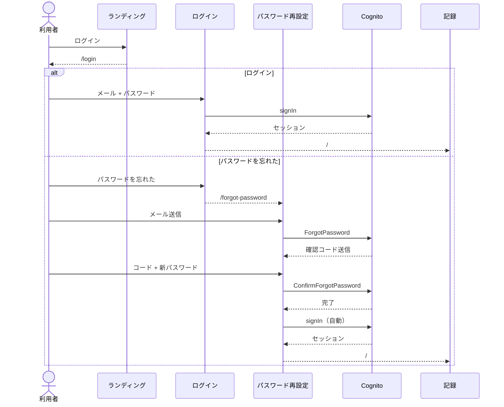
```mermaid
sequenceDiagram
  actor U as 利用者
  participant L as ランディング
  participant Login as ログイン
  participant FP as パスワード再設定
  participant Auth as Cognito
  participant Rec as 記録

  U->>L: ログイン
  L-->>U: /login
  alt ログイン
    U->>Login: メール + パスワード
    Login->>Auth: signIn
    Auth-->>Login: セッション
    Login-->>Rec: /
  else パスワードを忘れた
    U->>Login: パスワードを忘れた
    Login-->>FP: /forgot-password
    U->>FP: メール送信
    FP->>Auth: ForgotPassword
    Auth-->>FP: 確認コード送信
    U->>FP: コード + 新パスワード
    FP->>Auth: ConfirmForgotPassword
    Auth-->>FP: 完了
    FP->>Auth: signIn（自動）
    Auth-->>FP: セッション
    FP-->>Rec: /
  end
```

### 4.3 記録

任意入力のあと「記録する」。GPS がなくても保存できる（オフライン時は端末のみ）。

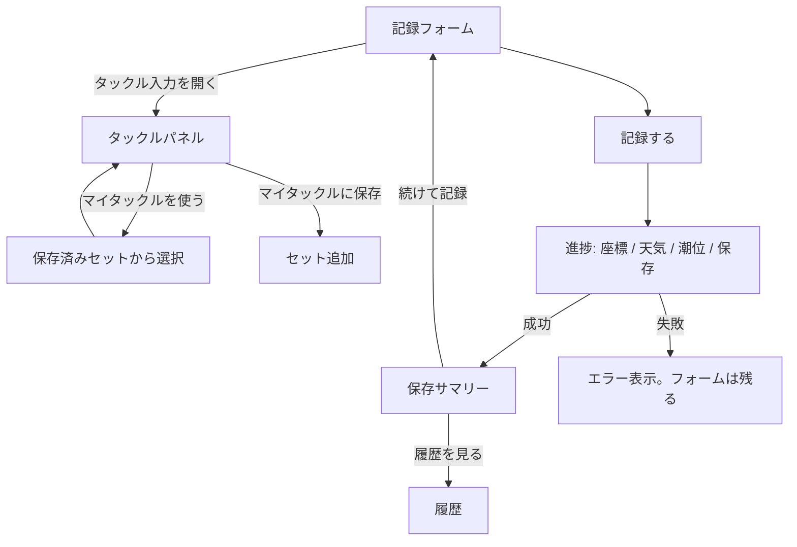
```mermaid
flowchart TD
  form["記録フォーム"] --> tap["記録する"]
  form -->|"タックル入力を開く"| tackle["タックルパネル"]
  tackle -->|"マイタックルを使う"| picker["保存済みセットから選択"]
  tackle -->|"マイタックルに保存"| saved["セット追加"]
  picker --> tackle

  tap --> progress["進捗: 座標 / 天気 / 潮位 / 保存"]
  progress -->|"成功"| summary["保存サマリー"]
  progress -->|"失敗"| err["エラー表示。フォームは残る"]

  summary -->|"続けて記録"| form
  summary -->|"履歴を見る"| history["履歴"]
```

フォームの主な項目:

- 写真（任意）
- 魚種（任意・候補入力）
- 体長・重さ（任意。単位はマイページ）
- タックル（任意。「次回もこのタックルを使う」で下書きを残す）

保存後、魚種・サイズ・写真はクリアする。タックルは「次回も使う」がオンなら残す。

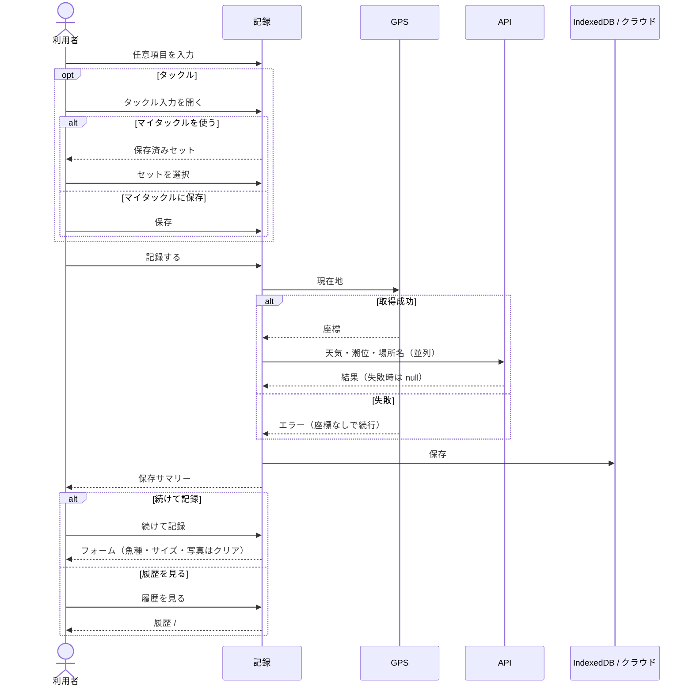
```mermaid
sequenceDiagram
  actor U as 利用者
  participant Rec as 記録
  participant GPS as GPS
  participant API as API
  participant Store as IndexedDB / クラウド

  U->>Rec: 任意項目を入力
  opt タックル
    U->>Rec: タックル入力を開く
    alt マイタックルを使う
      Rec-->>U: 保存済みセット
      U->>Rec: セットを選択
    else マイタックルに保存
      U->>Rec: 保存
    end
  end
  U->>Rec: 記録する
  Rec->>GPS: 現在地
  alt 取得成功
    GPS-->>Rec: 座標
    Rec->>API: 天気・潮位・場所名（並列）
    API-->>Rec: 結果（失敗時は null）
  else 失敗
    GPS-->>Rec: エラー（座標なしで続行）
  end
  Rec->>Store: 保存
  Rec-->>U: 保存サマリー
  alt 続けて記録
    U->>Rec: 続けて記録
    Rec-->>U: フォーム（魚種・サイズ・写真はクリア）
  else 履歴を見る
    U->>Rec: 履歴を見る
    Rec-->>U: 履歴 /
  end
```

### 4.4 履歴

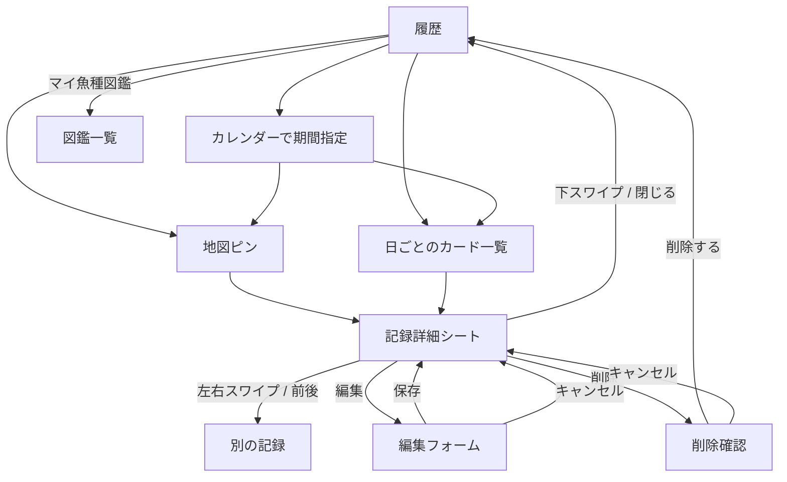
```mermaid
flowchart TD
  hist["履歴"] --> cal["カレンダーで期間指定"]
  hist --> map["地図ピン"]
  hist --> list["日ごとのカード一覧"]
  hist -->|"マイ魚種図鑑"| encyclo["図鑑一覧"]

  cal --> list
  cal --> map
  map --> sheet["記録詳細シート"]
  list --> sheet

  sheet -->|"左右スワイプ / 前後"| next["別の記録"]
  sheet -->|"下スワイプ / 閉じる"| hist
  sheet -->|"編集"| edit["編集フォーム"]
  sheet -->|"削除"| confirm["削除確認"]
  edit -->|"保存"| sheet
  edit -->|"キャンセル"| sheet
  confirm -->|"削除する"| hist
  confirm -->|"キャンセル"| sheet
```

- 期間はクエリ `?from=` `?to=`（または旧 `?date=`）でも初期化できる。
- 地図ピンは同じ地点の記録グループを開き、シート内でスワイプできる。
- 一覧タップはフィルタ後の全件をシートの前後対象にする。
- 空状態: 記録ゼロ / 期間内ゼロ。

編集フォームでは写真・魚種・サイズ・タックル・日時・地図上の座標を変えられる。座標や時刻を変えると天気・潮位などを取り直す。

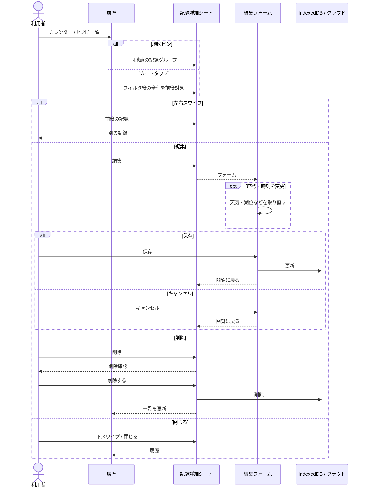
```mermaid
sequenceDiagram
  actor U as 利用者
  participant Hist as 履歴
  participant Sheet as 記録詳細シート
  participant Edit as 編集フォーム
  participant Store as IndexedDB / クラウド

  U->>Hist: カレンダー / 地図 / 一覧
  alt 地図ピン
    Hist-->>Sheet: 同地点の記録グループ
  else カードタップ
    Hist-->>Sheet: フィルタ後の全件を前後対象
  end
  alt 左右スワイプ
    U->>Sheet: 前後の記録
    Sheet-->>U: 別の記録
  else 編集
    U->>Sheet: 編集
    Sheet-->>Edit: フォーム
    opt 座標・時刻を変更
      Edit->>Edit: 天気・潮位などを取り直す
    end
    alt 保存
      U->>Edit: 保存
      Edit->>Store: 更新
      Edit-->>Sheet: 閲覧に戻る
    else キャンセル
      U->>Edit: キャンセル
      Edit-->>Sheet: 閲覧に戻る
    end
  else 削除
    U->>Sheet: 削除
    Sheet-->>U: 削除確認
    U->>Sheet: 削除する
    Sheet->>Store: 削除
    Sheet-->>Hist: 一覧を更新
  else 閉じる
    U->>Sheet: 下スワイプ / 閉じる
    Sheet-->>Hist: 履歴
  end
```

### 4.5 マイページ

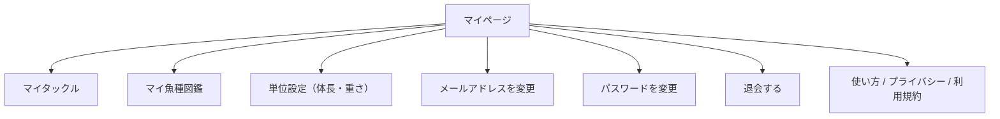
```mermaid
flowchart TD
  my["マイページ"] --> tackle["マイタックル"]
  my --> encyclo["マイ魚種図鑑"]
  my --> units["単位設定（体長・重さ）"]
  my --> email["メールアドレスを変更"]
  my --> pass["パスワードを変更"]
  my --> del["退会する"]
  my --> legal["使い方 / プライバシー / 利用規約"]
```

単位は表示と入力だけ変わり、保存済みの数値は変わらない。アカウント欄はクラウド有効時のみ。ローカルのみのときは「この端末に記録を保存しています」と出す。

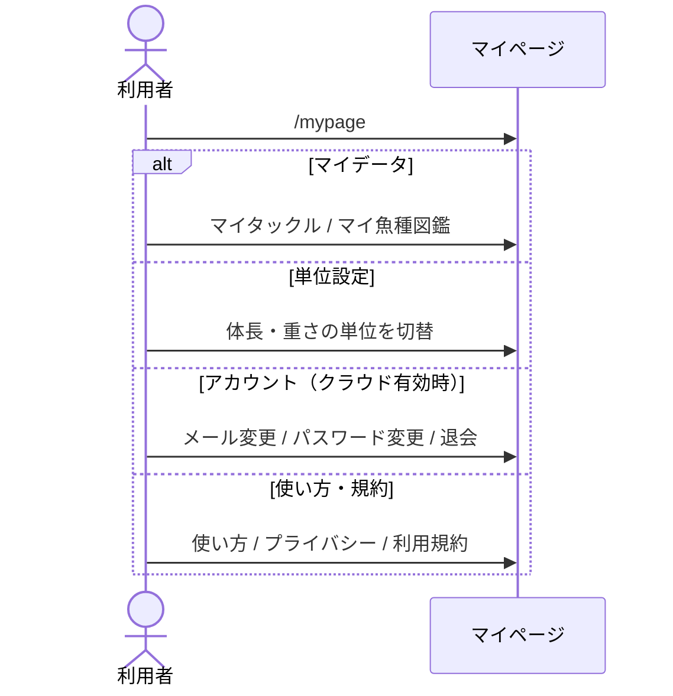
```mermaid
sequenceDiagram
  actor U as 利用者
  participant My as マイページ

  U->>My: /mypage
  alt マイデータ
    U->>My: マイタックル / マイ魚種図鑑
  else 単位設定
    U->>My: 体長・重さの単位を切替
  else アカウント（クラウド有効時）
    U->>My: メール変更 / パスワード変更 / 退会
  else 使い方・規約
    U->>My: 使い方 / プライバシー / 利用規約
  end
```

### 4.6 マイタックル

同一ページ内で一覧とフォームを切り替える（別ルートではない）。

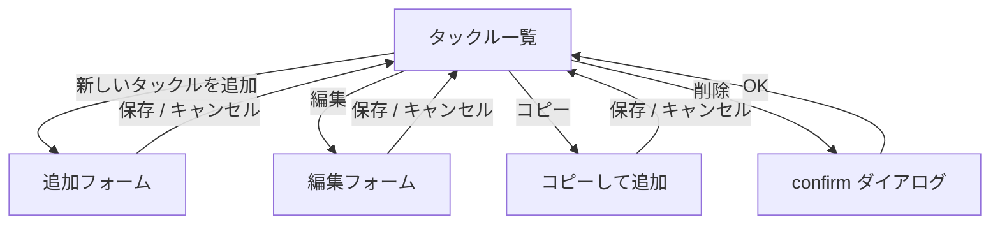
```mermaid
flowchart TD
  list["タックル一覧"] -->|"新しいタックルを追加"| create["追加フォーム"]
  list -->|"編集"| edit["編集フォーム"]
  list -->|"コピー"| copy["コピーして追加"]
  list -->|"削除"| confirm["confirm ダイアログ"]
  confirm -->|"OK"| list
  create -->|"保存 / キャンセル"| list
  edit -->|"保存 / キャンセル"| list
  copy -->|"保存 / キャンセル"| list
```

記録画面の「マイタックルに保存」でも同じセットに追加できる。

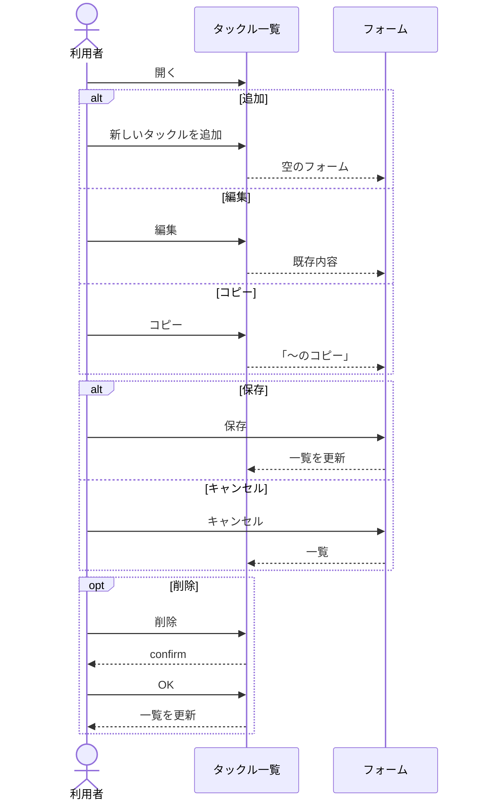
```mermaid
sequenceDiagram
  actor U as 利用者
  participant List as タックル一覧
  participant Form as フォーム

  U->>List: 開く
  alt 追加
    U->>List: 新しいタックルを追加
    List-->>Form: 空のフォーム
  else 編集
    U->>List: 編集
    List-->>Form: 既存内容
  else コピー
    U->>List: コピー
    List-->>Form: 「〜のコピー」
  end
  alt 保存
    U->>Form: 保存
    Form-->>List: 一覧を更新
  else キャンセル
    U->>Form: キャンセル
    Form-->>List: 一覧
  end
  opt 削除
    U->>List: 削除
    List-->>U: confirm
    U->>List: OK
    List-->>U: 一覧を更新
  end
```

### 4.7 マイ魚種図鑑

記録から魚種ごとの尾数・最大サイズなどを集計する。手入力の図鑑ではない。

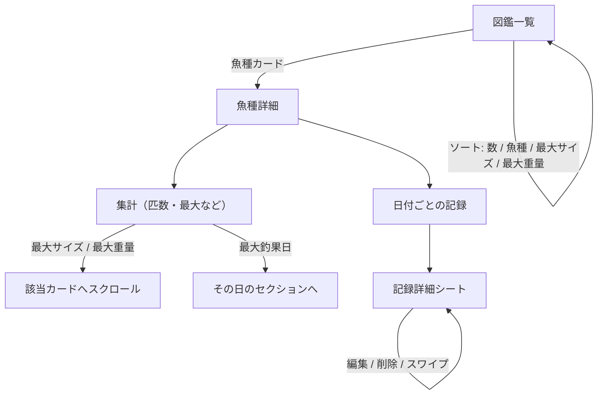
```mermaid
flowchart TD
  list["図鑑一覧"] -->|"ソート: 数 / 魚種 / 最大サイズ / 最大重量"| list
  list -->|"魚種カード"| detail["魚種詳細"]
  detail --> stats["集計（匹数・最大など）"]
  detail --> days["日付ごとの記録"]
  stats -->|"最大サイズ / 最大重量"| scrollRec["該当カードへスクロール"]
  stats -->|"最大釣果日"| scrollDay["その日のセクションへ"]
  days --> sheet["記録詳細シート"]
  sheet -->|"編集 / 削除 / スワイプ"| sheet
```

魚種詳細は `/mypage/encyclopedia/:species`。`?record=` と `?date=` で該当カードや日を強調する。

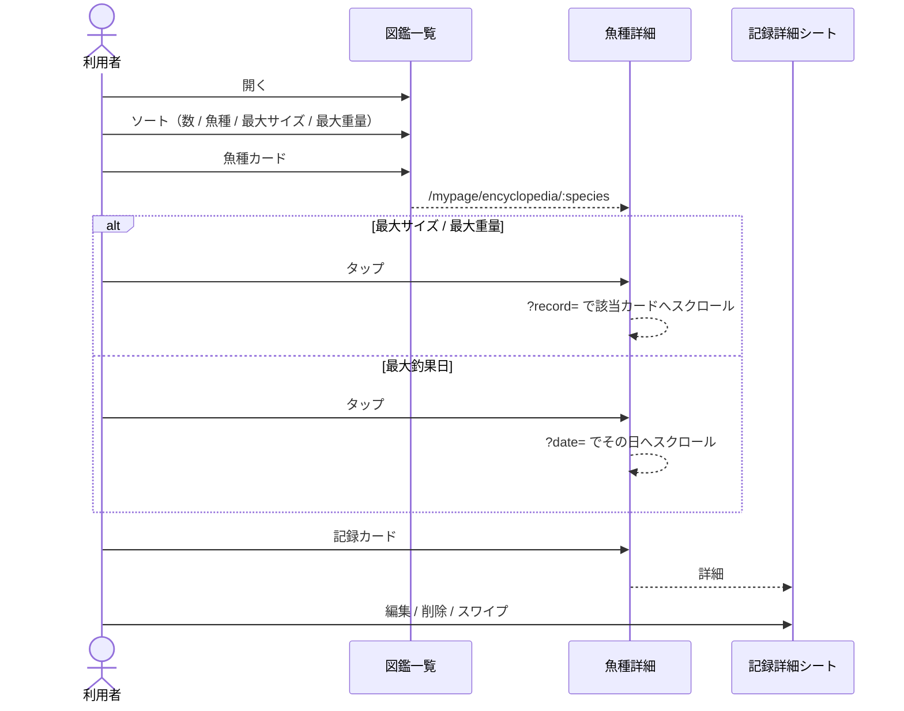
```mermaid
sequenceDiagram
  actor U as 利用者
  participant Enc as 図鑑一覧
  participant Sp as 魚種詳細
  participant Sheet as 記録詳細シート

  U->>Enc: 開く
  U->>Enc: ソート（数 / 魚種 / 最大サイズ / 最大重量）
  U->>Enc: 魚種カード
  Enc-->>Sp: /mypage/encyclopedia/:species
  alt 最大サイズ / 最大重量
    U->>Sp: タップ
    Sp-->>Sp: ?record= で該当カードへスクロール
  else 最大釣果日
    U->>Sp: タップ
    Sp-->>Sp: ?date= でその日へスクロール
  end
  U->>Sp: 記録カード
  Sp-->>Sheet: 詳細
  U->>Sheet: 編集 / 削除 / スワイプ
```

### 4.8 アカウント変更・退会

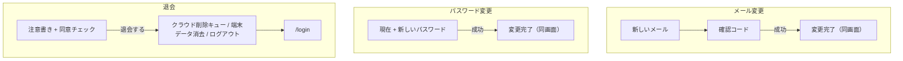
```mermaid
flowchart TD
  subgraph emailFlow ["メール変更"]
    e1["新しいメール"] --> e2["確認コード"]
    e2 -->|"成功"| e3["変更完了（同画面）"]
  end

  subgraph passFlow ["パスワード変更"]
    p1["現在 + 新しいパスワード"] -->|"成功"| p2["変更完了（同画面）"]
  end

  subgraph delFlow ["退会"]
    d1["注意書き + 同意チェック"] -->|"退会する"| d2["クラウド削除キュー / 端末データ消去 / ログアウト"]
    d2 --> d3["/login"]
  end
```

退会後はすぐログインできなくなる。クラウド上の記録・写真は 7 日以内に削除する旨を画面に出す。

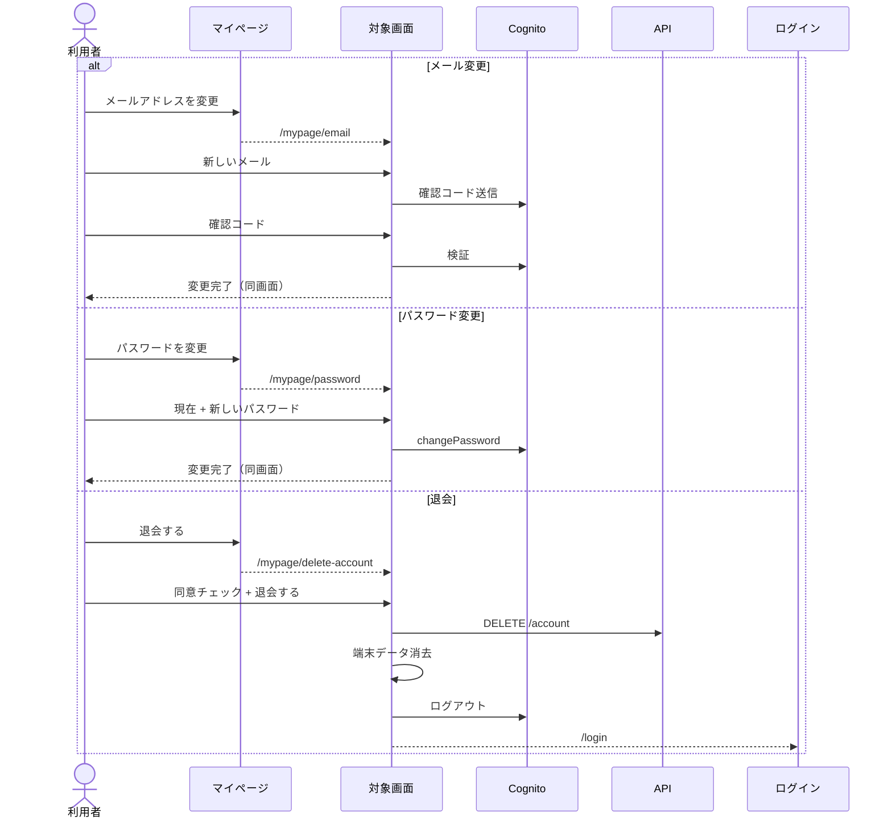
```mermaid
sequenceDiagram
  actor U as 利用者
  participant My as マイページ
  participant Page as 対象画面
  participant Auth as Cognito
  participant API as API
  participant Login as ログイン

  alt メール変更
    U->>My: メールアドレスを変更
    My-->>Page: /mypage/email
    U->>Page: 新しいメール
    Page->>Auth: 確認コード送信
    U->>Page: 確認コード
    Page->>Auth: 検証
    Page-->>U: 変更完了（同画面）
  else パスワード変更
    U->>My: パスワードを変更
    My-->>Page: /mypage/password
    U->>Page: 現在 + 新しいパスワード
    Page->>Auth: changePassword
    Page-->>U: 変更完了（同画面）
  else 退会
    U->>My: 退会する
    My-->>Page: /mypage/delete-account
    U->>Page: 同意チェック + 退会する
    Page->>API: DELETE /account
    Page->>Page: 端末データ消去
    Page->>Auth: ログアウト
    Page-->>Login: /login
  end
```

### 4.9 ログアウト

同期バナーの「ログアウト」のみ。成功すると未ログインになり、`/` はランディングになる。ログイン・公開ページではバナー自体を出さない。

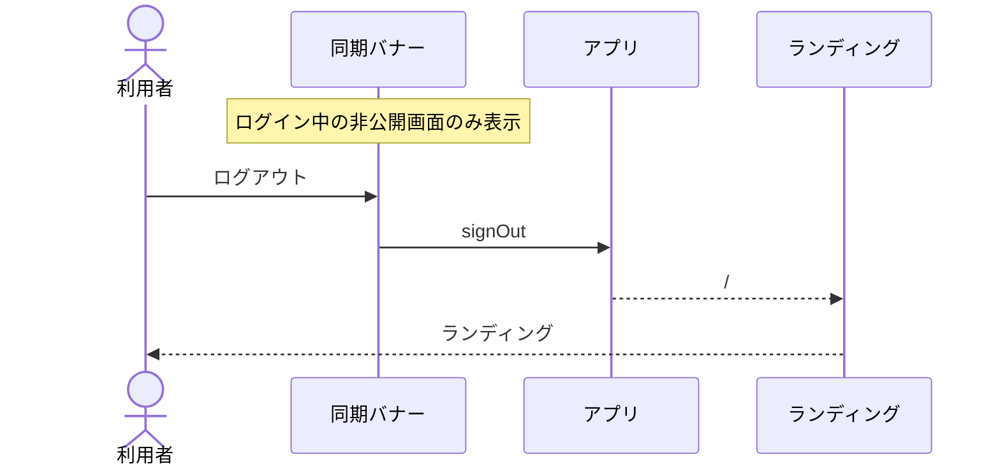
```mermaid
sequenceDiagram
  actor U as 利用者
  participant Banner as 同期バナー
  participant App as アプリ
  participant L as ランディング

  Note over Banner: ログイン中の非公開画面のみ表示
  U->>Banner: ログアウト
  Banner->>App: signOut
  App-->>L: /
  L-->>U: ランディング
```

---

## 5. 公開ページの戻り先

`/guide` `/privacy` `/terms` の「戻る」は、ログイン済みまたはローカルのみなら `/mypage`、未ログイン（クラウド有効）なら `/`。

---

## 6. 共通シェル

ログイン中の非公開画面:

```
┌─────────────────────────┐
│ 同期バナー（ログアウト） │
│ 各ページ本体             │
│ ボトムナビ               │
│  記録 / 履歴 / マイページ │
└─────────────────────────┘
```

パス変更時はウィンドウ先頭へスクロールする。
