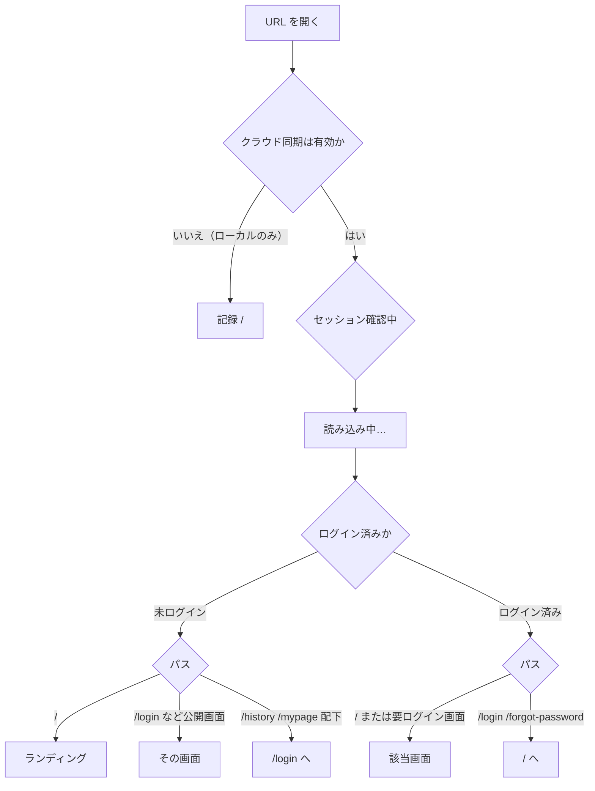
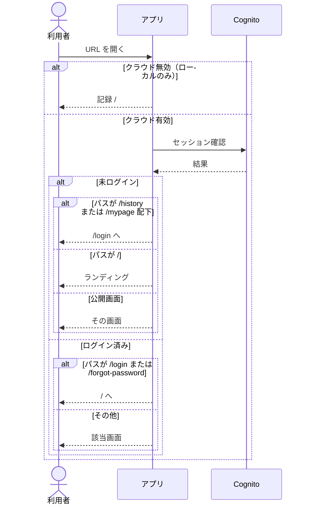
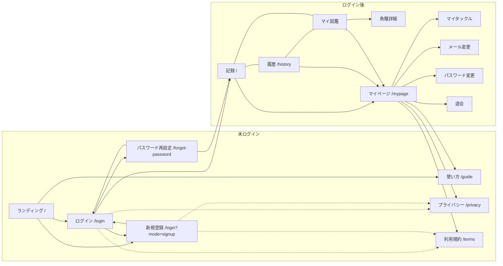

# 画面設計

現行コード（`src/App.tsx` と各ページ）に基づく画面構成と遷移。ルート以外のオーバーレイも書く。

全体像は [画面概要](../overview.md)。実装ファイルは `実装` 列に、ルートは `src/App.tsx` の定義どおり。画面のつながりはフローチャート、画面間のやり取りはシーケンス図。項目・操作は [画面 IF](../if.md)。画面が叩く HTTP API は [API 概要](../../api/overview.md) / [API IF](../../api/if.md) / [API 設計](../../api/design/README.md)。

| 資料 | 内容 |
|------|------|
| [画面一覧](#画面一覧) | ルートとオーバーレイ |
| [認証ゲート](#認証ゲート) | クラウド有無・ログイン状態での出し分け |
| [全体マップ](#全体マップ) | 画面のつながり |
| [公開・認証](auth.md) | ランディング、登録、ログイン、パスワード再設定、ログアウト |
| [記録](record.md) | 保存フローとタックルパネル |
| [履歴](history.md) | カレンダー・地図・詳細シート・編集 |
| [マイページ](mypage.md) | タックル、単位、アカウント。魚種図鑑はボトムナビ |
| [共通シェル](#共通シェル) | 同期バナーとボトムナビ |

---

## 画面一覧

### ルート

| パス | 画面 | 実装 | 認証 | ボトムナビ | 設計 |
|------|------|------|------|------------|------|
| `/` | 未ログインかつクラウド有効ならランディング。それ以外は記録 | `RootPage` → `LandingPage` / `HomePage` | 公開 | ログイン時のみ | [公開・認証](auth.md) / [記録](record.md) |
| `/login` | ログイン / 新規登録 / 確認コード | `LoginPage` | 公開。ログイン済みなら `/` | なし | [公開・認証](auth.md) |
| `/forgot-password` | パスワード再設定 | `ForgotPasswordPage` | 公開。ログイン済みなら `/` | なし | [公開・認証](auth.md) |
| `/guide` | 使い方 | `GuidePage` | 公開 | なし | [公開・認証](auth.md) |
| `/privacy` | プライバシーポリシー | `LegalPage` | 公開 | なし | [公開・認証](auth.md) |
| `/terms` | 利用規約 | `LegalPage` | 公開 | なし | [公開・認証](auth.md) |
| `/history` | 履歴（カレンダー・地図・一覧） | `HistoryPage` | 要ログイン | あり | [履歴](history.md) |
| `/history/map` | `/history` へリダイレクト（旧 URL） | `HistoryMapRedirect` | 要ログイン | — | [履歴](history.md) |
| `/mypage` | マイページ | `MyPage` | 要ログイン | あり | [マイページ](mypage.md) |
| `/mypage/tackle` | マイタックル | `MyTacklePage` | 要ログイン | あり | [マイページ](mypage.md#マイタックル) |
| `/mypage/encyclopedia` | マイ魚種図鑑（一覧） | `FishEncyclopediaPage` | 要ログイン | あり | [マイページ](mypage.md#マイ魚種図鑑) |
| `/mypage/encyclopedia/:species` | 魚種詳細 | `FishEncyclopediaSpeciesPage` | 要ログイン | あり | [マイページ](mypage.md#マイ魚種図鑑) |
| `/mypage/email` | メールアドレス変更 | `ChangeEmailPage` | 要ログイン・クラウド必須 | あり | [マイページ](mypage.md#アカウント変更退会) |
| `/mypage/password` | パスワード変更 | `ChangePasswordPage` | 要ログイン・クラウド必須 | あり | [マイページ](mypage.md#アカウント変更退会) |
| `/mypage/delete-account` | 退会 | `DeleteAccountPage` | 要ログイン・クラウド必須 | あり | [マイページ](mypage.md#アカウント変更退会) |

公開コンテンツ（`/guide` `/privacy` `/terms`）では、ログイン中でもボトムナビと同期バナーを出さない。

### ルートではない UI

| UI | 出る場所 | 内容 |
|----|----------|------|
| 同期バナー | ログイン中の非公開画面 | マイページ、メール表示、ログアウト（ローカルのみはマイページだけ） |
| ボトムナビ | ログイン中の非公開画面 | 記録 / 履歴 / マイ図鑑 |
| タックル入力パネル | 記録 | 開閉。マイタックルの呼び出し・保存 |
| 記録進捗・保存サマリー | 記録 | 「記録する」後 |
| 記録詳細シート | 履歴・魚種詳細 | 閲覧 / スワイプ切替 / 編集 / 削除確認 |
| 座標ピッカー地図 | 記録詳細シートの編集 | 位置の指定し直し |

---

## 認証ゲート

クラウド同期の有無（Cognito 設定の有無）でルートの出し分けが変わる。





- **要ログイン**: `RequireAuth`。クラウド有効かつ未ログインなら `/login`。ローカルのみなら通す。
- **ゲスト記録なし**: クラウド有効かつ未ログインでは記録できない。`/` はランディング専用。
- **クラウド必須の下位画面**（メール変更・パスワード変更・退会）: ローカルのみなら `/mypage` へ戻す。
- ログイン済みで `/login` または `/forgot-password` を開くと `/` へ戻す。

---

## 全体マップ

ログイン後の主画面と、未ログイン時の入口。



ボトムナビは記録・履歴・マイ図鑑の 3 タブ。マイページは同期バナーと同じ行。下位画面でもナビは表示したまま、戻るは各画面のヘッダー。

---

## 共通シェル

ログイン中の非公開画面:

```
┌──────────────────────────────┐
│ マイページ  メール  ログアウト     │
│ 各ページ本体                    │
│ ボトムナビ                      │
│  記録 / 履歴 / マイ図鑑          │
└──────────────────────────────┘
```

パス変更時はウィンドウ先頭へスクロールする。
