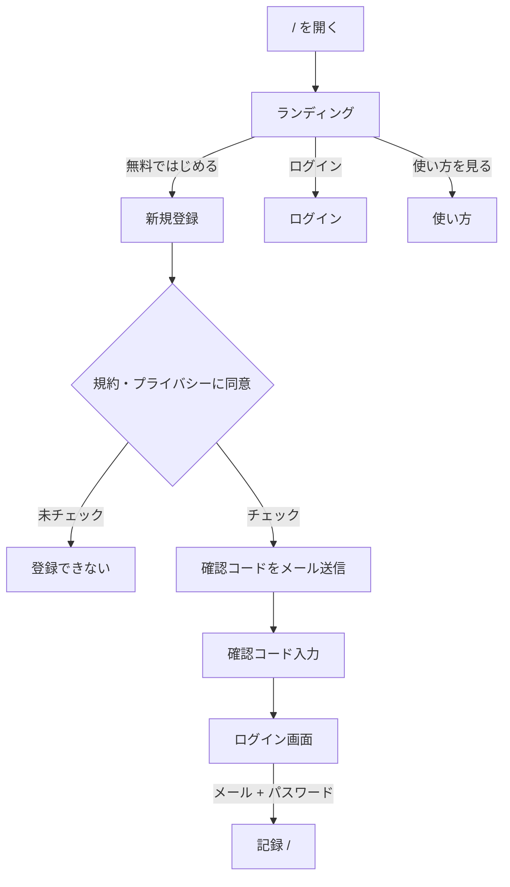
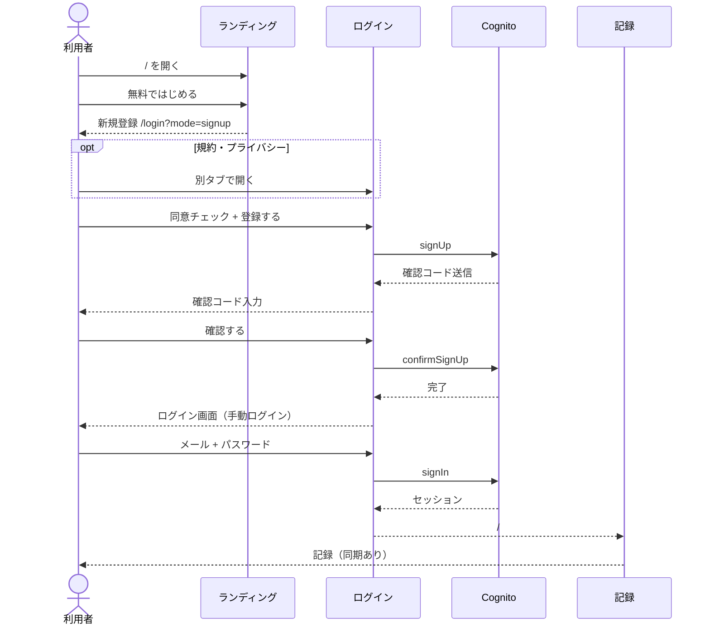
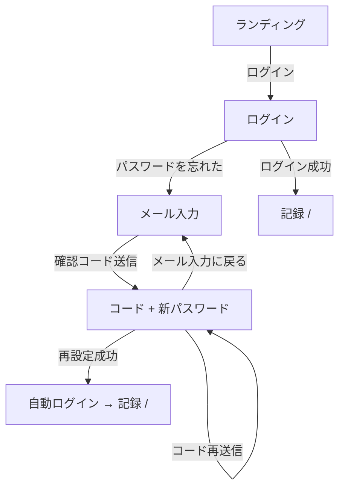
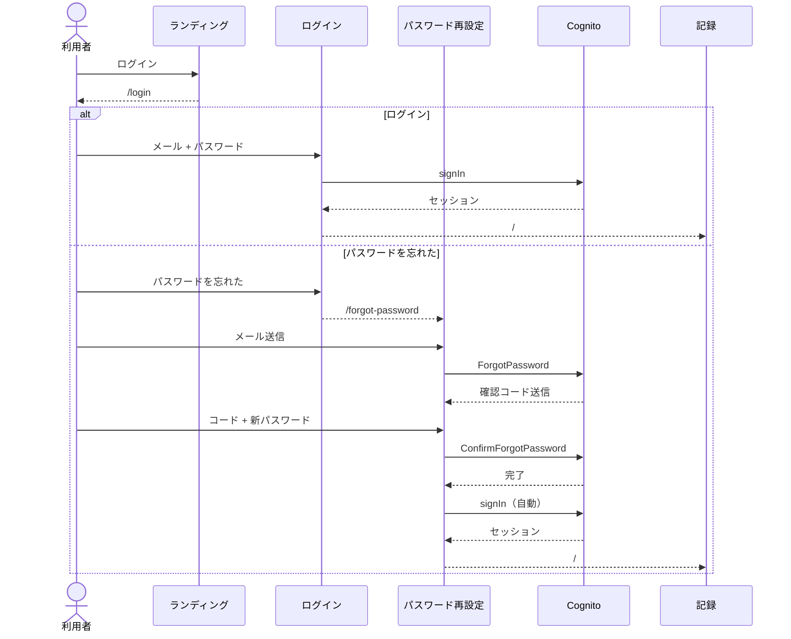
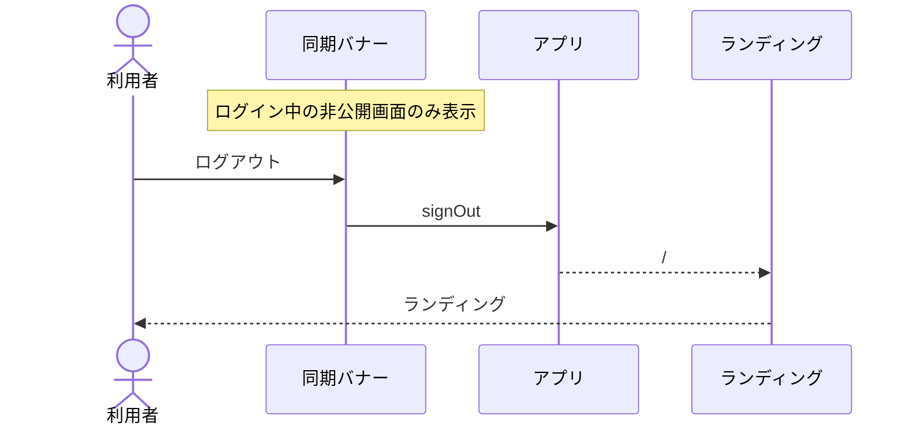

# 公開・認証

[画面設計](README.md) / [画面概要](../overview.md) / [画面 IF 公開・認証](../if.md#3-公開認証)

ランディング、新規登録、ログイン、パスワード再設定、ログアウト、使い方・規約の戻り先。

---

## 初回: ランディング → 登録 → 記録

- クラウド有効時、ランディングでは記録できない。登録・ログイン後に記録する。
- 新規登録は `/login?mode=signup`。規約・プライバシーは別タブで開く。
- 確認コード成功後はログイン画面に戻り、手動ログインする（自動ログインではない）。
- ログイン後は [画面 IF 1.5](../if.md#15-同期)。未送信件（ログイン済みオフライン中に付けたもの）があれば POST し、クラウドの生存件と削除ログも取り込む。未ログインで記録は付かない。

---

## 復帰: ログイン / パスワード再設定

パスワード再設定は成功すると新パスワードで自動ログインし、`/` へ進む。

---

## ログアウト

同期バナーの「ログアウト」（クラウド有効時）。成功すると未ログインになり、`/` はランディングになる。ログイン・公開ページ・ローカルのみではバナー自体を出さない。

---

## 公開ページの戻り先

`/guide` `/privacy` `/terms` の「戻る」は、ログイン済みまたはローカルのみなら `/mypage`、未ログイン（クラウド有効）なら `/`。
