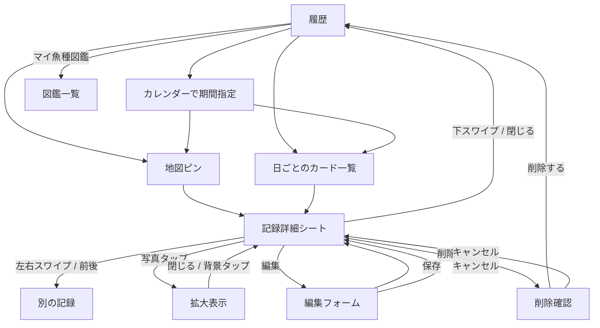
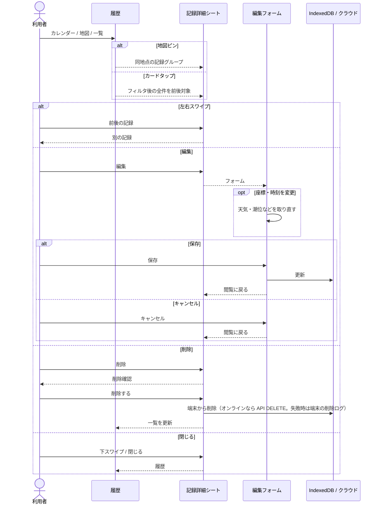

# 履歴

[画面設計](README.md) / [画面概要](../overview.md) / [画面 IF SCR-07〜09](../if.md#4-記録履歴)

- 期間はクエリ `?from=` `?to=`（または旧 `?date=`）でも初期化できる。
- 地図ピンは同じ地点の記録グループを開き、シート内でスワイプできる。
- 一覧タップはフィルタ後の全件をシートの前後対象にする。
- 空状態: 記録ゼロ / 期間内ゼロ。
- 詳細シートは写真・環境値の下に、記録日の潮位グラフを出す（クラウドかつ座標あり。記録時刻の印、当日ならいま、満潮・干潮。失敗時は出さない）。
- 削除は端末からすぐ消す。他端末の削除は同期時だけ、削除ログを見て消す（[画面 IF 1.5](../if.md#15-同期)）。

編集フォームでは写真・魚種・サイズ・タックル・日時・地図上の座標を変えられる。座標や時刻を変えると天気・潮位などを取り直す。

