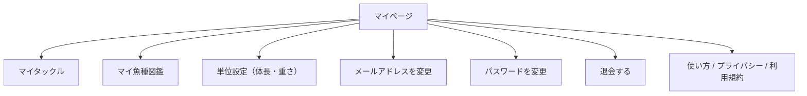
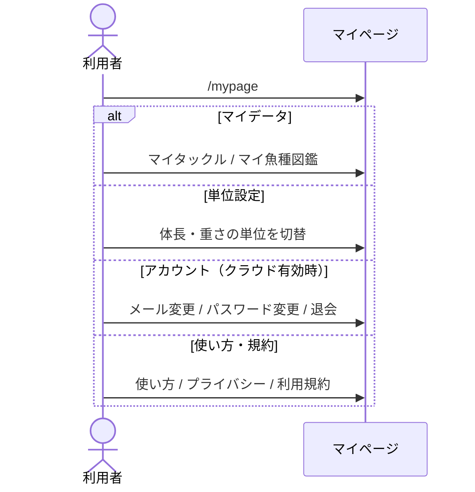
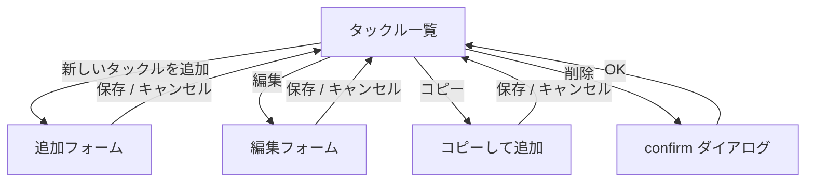
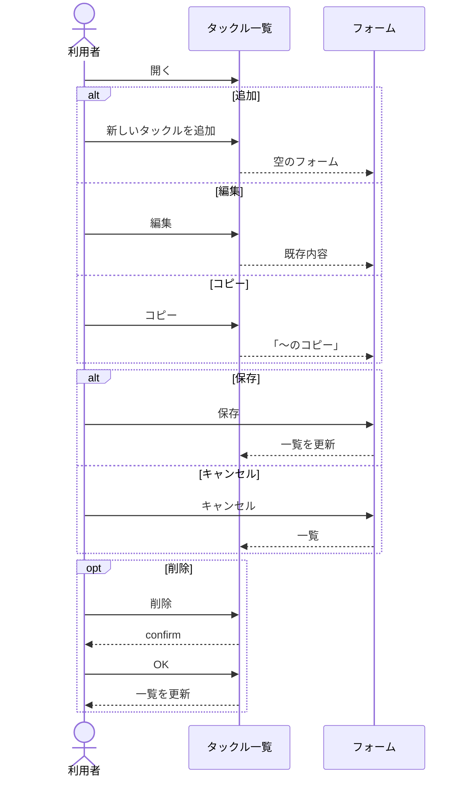
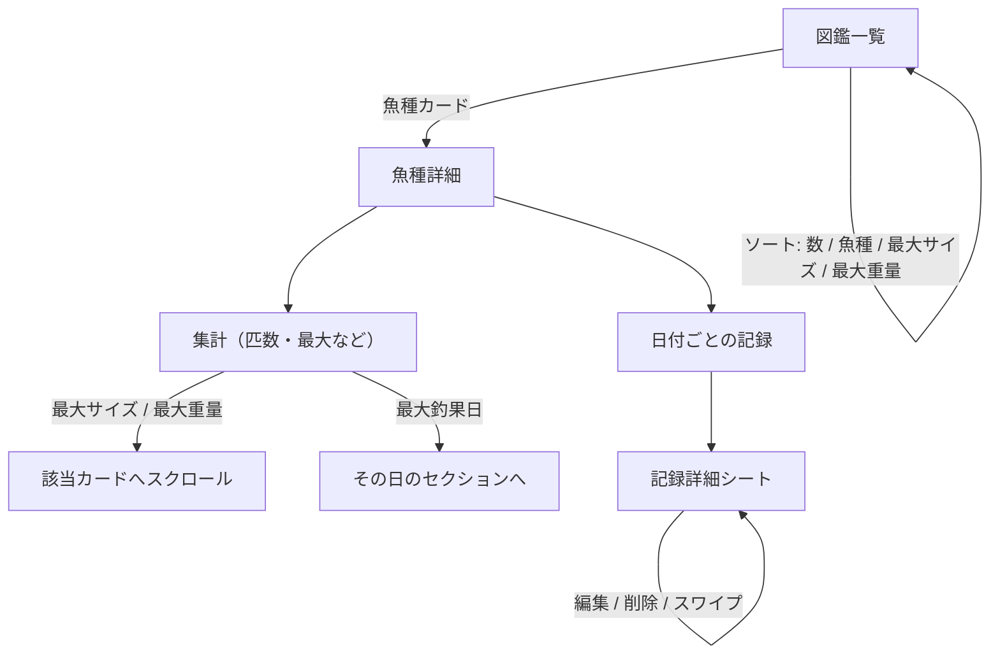
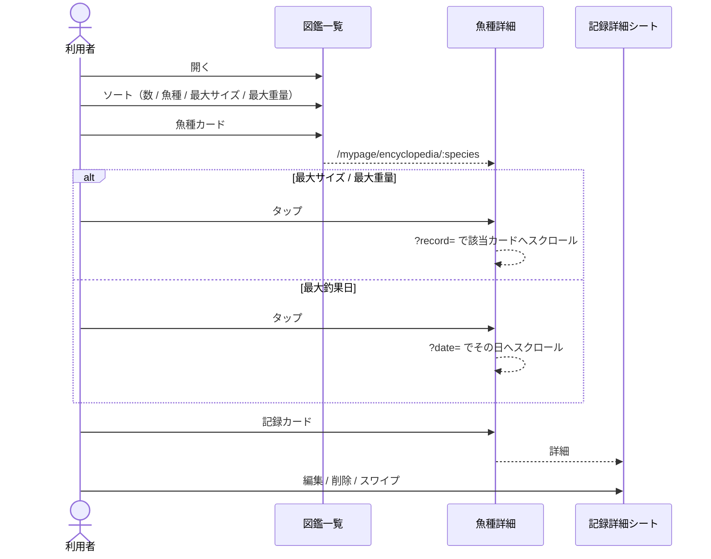
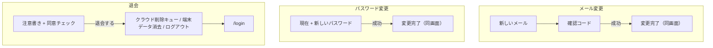
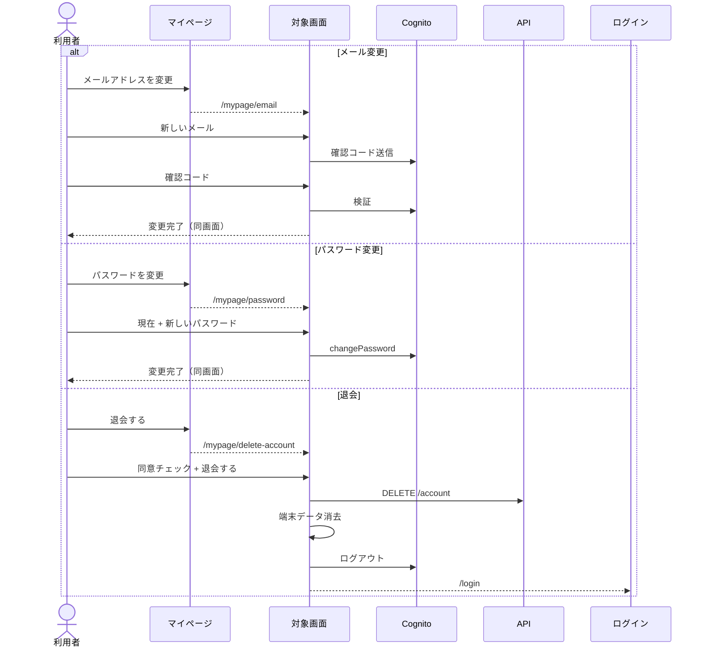

# マイページ

[画面設計](README.md) / [画面概要](../overview.md) / [画面 IF SCR-10](../if.md#scr-10-マイページ)

単位は表示と入力だけ変わり、保存済みの数値は変わらない。アカウント欄はクラウド有効時のみ。ローカルのみのときは「この端末に記録を保存しています」と出す。

---

## マイタックル

[画面 IF SCR-11](../if.md#scr-11-マイタックル)

同一ページ内で一覧とフォームを切り替える（別ルートではない）。

記録画面の「マイタックルに保存」でも同じセットに追加できる。

---

## マイ魚種図鑑

[画面 IF SCR-12](../if.md#scr-12-マイ魚種図鑑)

記録から魚種ごとの尾数・最大サイズなどを集計する。一覧カードにはその魚種の代表画像（写真付き記録のうち最大サイズ）を出す。手入力の図鑑ではない。

魚種詳細は `/mypage/encyclopedia/:species`。`?record=` と `?date=` で該当カードや日を強調する。

---

## アカウント変更・退会

[画面 IF SCR-14〜16](../if.md#scr-14-メールアドレス変更)

退会後はすぐログインできなくなる。クラウド上の記録・写真は 7 日以内に削除する旨を画面に出す。

