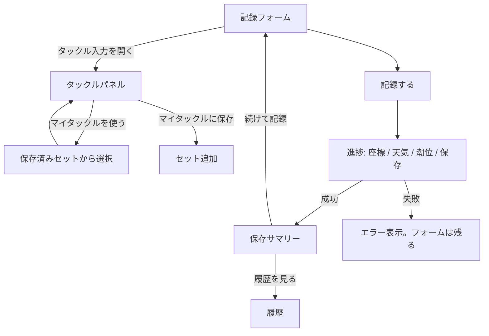
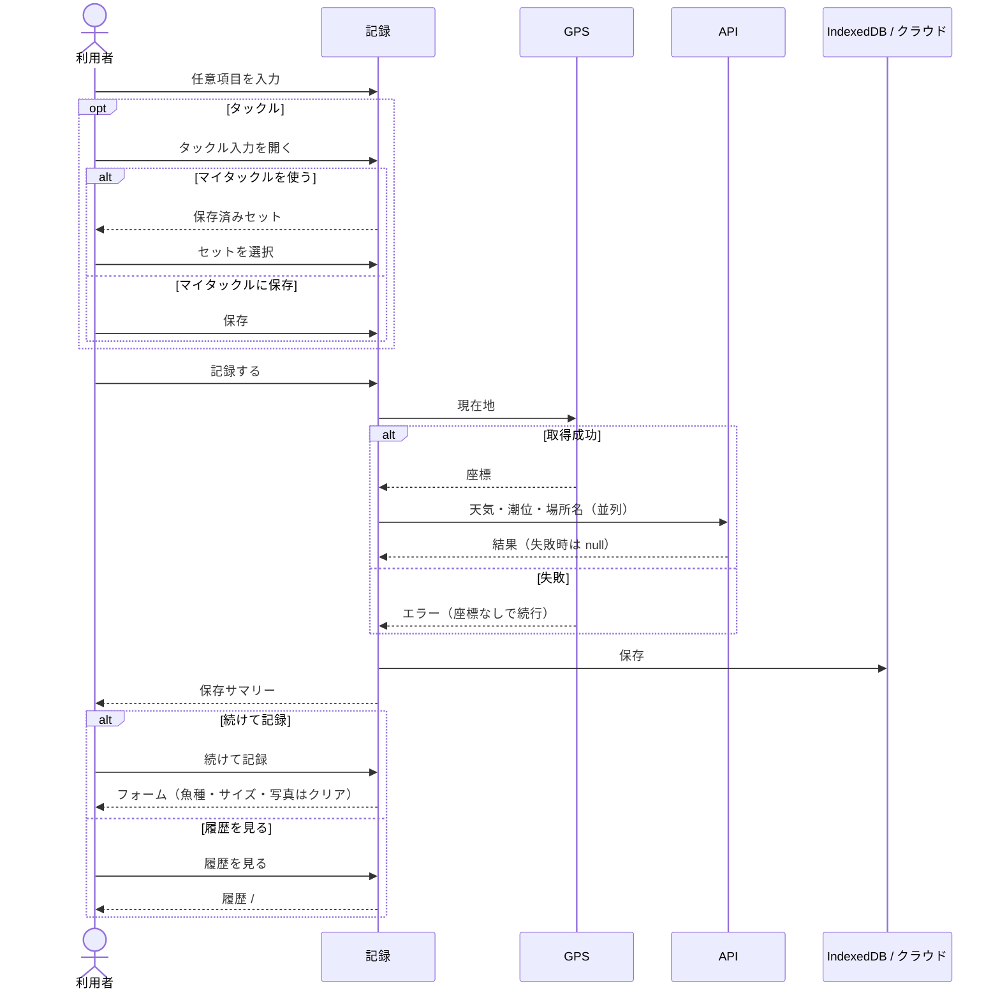

# 記録

[画面設計](README.md) / [画面概要](../overview.md) / [画面 IF SCR-06](../if.md#scr-06-記録)

任意入力のあと「記録する」。GPS がなくても保存できる（オフライン時は端末のみ）。

フォームの主な項目:

- 写真（任意）
- 魚種（任意・候補入力）
- 体長・重さ（任意。単位はマイページ）
- タックル（任意。「次回もこのタックルを使う」で下書きを残す）

保存後、魚種・サイズ・写真はクリアする。タックルは「次回も使う」がオンなら残す。

