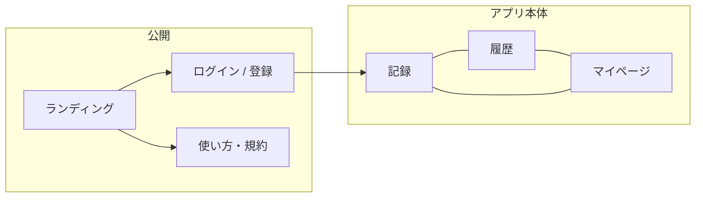

# 画面概要

cast mark の画面は、未ログイン時の入口と、ログイン後の「記録 / 履歴 / マイページ」の 3 領域で構成する。記録の正は端末（IndexedDB）。クラウドはログイン時の同期先。

| 次に読む | 内容 |
|----------|------|
| [画面設計](design.md) | 画面一覧・認証ゲート・遷移・主要フロー |
| [画面 IF](if.md) | 項目・操作・メッセージ・画面 ID |

HTTP API の全体像は [API 概要](../api/overview.md)。

---

## 役割

スマホ向け釣り記録 PWA。ワンタップで気温・時刻・座標・潮位・魚種を残す。写真・タックル・体長・重さは任意。オフラインでも端末に保存できる。

クラウド同期（Cognito）が無いときは、未ログインでも記録画面から使える（ローカルのみ）。

---

## 領域

ログイン後の主画面はボトムナビの 3 タブ。下位画面（タックル・図鑑・アカウント変更など）もナビは出したまま、戻るは各画面のヘッダー。

| 領域 | 何をするか | 設計 | IF |
|------|------------|------|-----|
| 公開・認証 | ランディング、ログイン / 登録、パスワード再設定、使い方・規約 | [認証ゲート](design.md#2-認証ゲート) / [初回](design.md#41-初回-ランディング--登録--記録) / [復帰](design.md#42-復帰-ログイン--パスワード再設定) | [公開・認証](if.md#3-公開認証) / [静的ページ](if.md#6-静的ページ) |
| 記録 | 任意入力のあと保存。GPS・天気・潮位は取れなくても保存できる | [記録](design.md#43-記録) | [SCR-06](if.md#scr-06-記録) |
| 履歴 | カレンダー・地図・一覧。詳細シートで閲覧 / 編集 / 削除 | [履歴](design.md#44-履歴) | [SCR-07](if.md#scr-07-履歴) / [SCR-08](if.md#scr-08-記録詳細シート) / [SCR-09](if.md#scr-09-記録編集) |
| マイページ | タックル、魚種図鑑、単位、アカウント、規約 | [マイページ](design.md#45-マイページ) | [SCR-10](if.md#scr-10-マイページ) |

ルートの一覧は [画面設計 1. 画面一覧](design.md#1-画面一覧)。画面 ID の対応は [画面 IF 1.4](if.md#14-画面-id)。

---

## 公開・認証

クラウド有効かつ未ログインなら `/` はランディング。「無料ではじめる」で登録、「ログイン」で復帰。使い方・プライバシー・利用規約はログイン前後どちらからも開ける。

要ログイン画面（履歴・マイページ配下）は未ログインなら `/login` へ。ログイン済みでログイン画面を開くと記録 `/` へ戻す。

詳細: [画面設計 2. 認証ゲート](design.md#2-認証ゲート)

---

## 記録

ホーム。魚種・サイズ・写真・タックルは任意。「記録する」で座標・天気・潮位を取って保存する。失敗してもフォームは残る。保存後は続けて記録するか、履歴へ進む。

タックルはパネルで入力し、マイタックルへの保存・呼び出しができる。

詳細: [画面設計 4.3](design.md#43-記録) / [画面 IF SCR-06](if.md#scr-06-記録)

---

## 履歴

期間をカレンダーで絞り、地図ピンまたは日ごとのカードから記録詳細シートを開く。シート内で前後の記録へスワイプし、編集・削除できる。座標や時刻を変えると天気・潮位などを取り直す。

空状態は「記録ゼロ」と「期間内ゼロ」の 2 種。

詳細: [画面設計 4.4](design.md#44-履歴) / [画面 IF SCR-07〜09](if.md#4-記録履歴)

---

## マイページ

マイデータ（タックル・魚種図鑑）、単位（体長・重さの表示）、アカウント（メール変更・パスワード変更・退会。クラウド有効時のみ）、静的ページへのリンク。

- **マイタックル**: 一覧と同じページで追加・編集・コピー・削除。[設計 4.6](design.md#46-マイタックル) / [IF SCR-11](if.md#scr-11-マイタックル)
- **マイ魚種図鑑**: 記録からの集計。手入力の図鑑ではない。[設計 4.7](design.md#47-マイ魚種図鑑) / [IF SCR-12](if.md#scr-12-マイ魚種図鑑)
- **アカウント**: 変更は同画面で完了。退会はクラウド削除キュー・端末消去・ログアウト。[設計 4.8](design.md#48-アカウント変更退会) / [IF SCR-14〜16](if.md#scr-14-メールアドレス変更)

---

## 共通シェル

ログイン中の非公開画面だけ、同期バナー（メール + ログアウト）とボトムナビ（記録 / 履歴 / マイページ）を出す。公開ページでは出さない。

詳細: [画面設計 6. 共通シェル](design.md#6-共通シェル) / [画面 IF 1.2](if.md#12-シェル)
