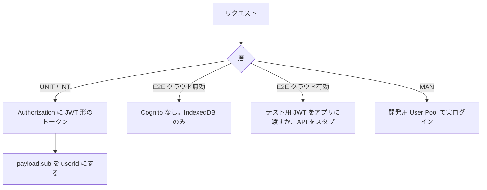
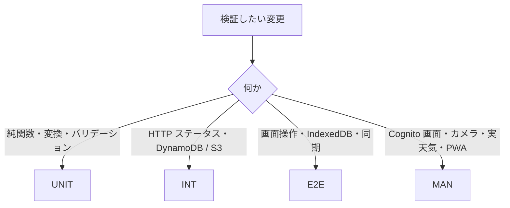

# テスト設計

画面 IF・API IF を正とするローカル検証の方針。ケースの列挙は [テスト IF](../if.md)。全体像は [テスト概要](../overview.md)。

| 資料 | 内容 |
|------|------|
| [方針](#方針) | 正・範囲・分離 |
| [環境](#環境) | スタック・認証・データの扱い |
| [層と実行](#層と実行) | UNIT / INT / E2E / MAN |
| [単体](unit.md) | 純関数の対象 |
| [API](api.md) | handler + LocalStack |
| [画面](screens.md) | E2E と手動 |

実装（Vitest / Playwright の導入、npm scripts）は本資料のあと。いまコード上のテストは `api/test-events/health.json` のみ。

---

## 方針

1. **仕様書が正。** 期待値は [画面 IF](../../screens/if.md) と [API IF](../../api/if.md) から取る。実装の都合で仕様を変えない。
2. **本番と分離。** 自動テストは本番 DynamoDB / S3 / Cognito / API Gateway を叩かない。
3. **決定的にする。** 自動テストは OpenWeather・Nominatim・海しるをモックする。時刻・座標はフィクスチャ固定。
4. **記録は端末が正。** クラウド失敗・オフラインでも IndexedDB に残ることを E2E で見る。API 側は自分の `sub` だけ見えることを INT で見る。
5. **SAM local は主経路にしない。** 自動 API テストは `api/src/handler.ts` をプロセス内で呼ぶ。SAM local は手動と、必要なら E2E の HTTP 先。

対象外（当面）:

- 本番・ステージング AWS
- 負荷・耐久
- セキュリティ監査（OWASP 等）
- 複数ブラウザ / 実機の網羅（手動で代表確認）
- CI への組み込み（ローカルが動いてから）

---

## 環境

開発と同じ Docker Compose（LocalStack の DynamoDB + S3）。テーブル・バケットは `scripts/local-init.mjs` が作る。

| 項目 | 値（ローカル既定） |
|------|-------------------|
| LocalStack | `http://127.0.0.1:4566` |
| 記録テーブル | `fissingplotter-records` |
| 天気キャッシュ | `fissingplotter-weather-cache` |
| 退会キュー | `fissingplotter-account-deletions` |
| 写真バケット | `fissingplotter-media-local` |
| API（手動 / E2E HTTP） | `http://127.0.0.1:3000` |
| フロント | `http://127.0.0.1:5173` |
| GPS フォールバック | `VITE_DEV_LAT` / `VITE_DEV_LNG`（未設定なら横浜新港付近） |

### 認証

`LOCAL_DEV=true` のとき Lambda は API Gateway オーソライザを使わず、JWT の `sub` を読む（署名検証なし）。取れなければ `LOCAL_DEV_USER_ID`。詳細は [API 設計 認証](../../api/design/README.md#認証と共通仕様)。

自動テストでは署名済みの本番トークンは使わない。payload に `sub`（と退会テスト用の email）を入れた JWT 形文字列で足りる。

### データ

| 層 | 分離 |
|----|------|
| UNIT | 状態なし |
| INT | ケースごとに一意の `userId`（`sub`）。共有テーブルは汚れるので、検証は自分の `sub` の件だけ見る |
| E2E | ケース前に IndexedDB `fissingplotter` と `localStorage` を消す |
| MAN | 開発用アカウント。本番ユーザーでログインしない |

写真の presigned URL は `AWS_ENDPOINT_URL_PUBLIC=http://127.0.0.1:4566` が無いとブラウザから開けない（[ローカル開発](../../_archive/2026-08-28/local-dev.md) と同じ）。

### 外部 API

| ソース | 自動 | 手動 |
|--------|------|------|
| OpenWeatherMap | モック。キー未設定の 500 も INT で見る | 実キー |
| Nominatim | モック | 実リクエスト（間隔制限あり） |
| 海しる | モック | 実キー |
| Cognito AdminDeleteUser | INT では SDK をモック。LocalStack の Cognito は使わない | 開発用 Pool |

---

## 層と実行

導入後の想定コマンド（実装時に `package.json` へ足す）:

| コマンド（案） | 層 | 前提 |
|----------------|-----|------|
| `npm test` | UNIT | Docker 不要 |
| `npm run test:api` | INT | LocalStack up + `local:init` |
| `npm run test:e2e` | E2E | Vite。クラウド有効ケースは API も |
| `npm run dev` / `dev:api` | MAN | 既存の開発起動 |

合格の目安:

- UNIT / INT / クラウド無効 E2E がローカルで緑
- クラウド有効 E2E は LocalStack が上がっているとき
- MAN はリリース前と、Cognito / 外部 API を触ったとき

ケース ID の規則は [テスト IF 1.1](../if.md#11-id)。
