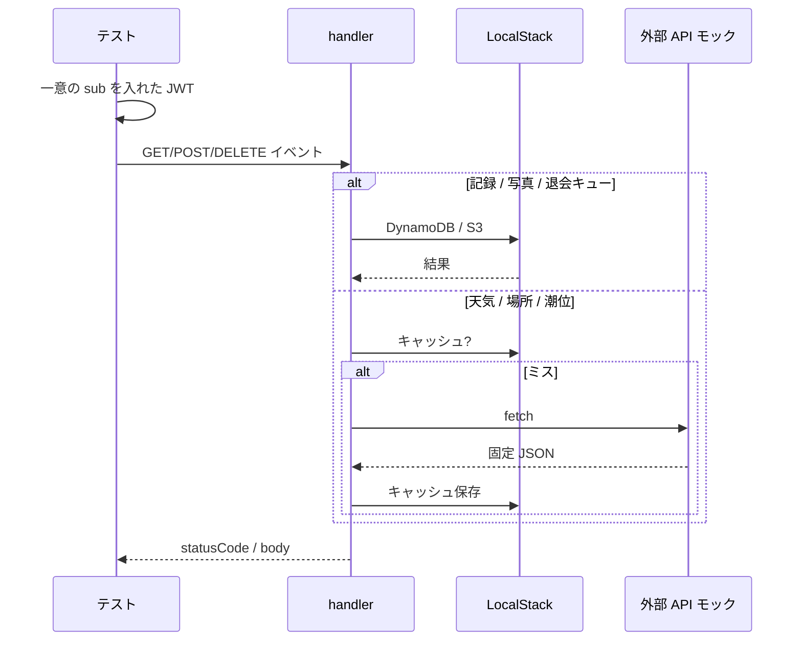

# API 結合テスト

[テスト設計](README.md) / [テスト概要](../overview.md) / [テスト IF INT](../if.md#3-api-結合-int)

`api/src/handler.ts` に API Gateway HTTP API v2 イベントを渡す。DynamoDB / S3 は LocalStack。OpenWeather / Nominatim / 海しる / Cognito はモック。

SAM local は使わない（イベント形は `api/test-events/` を流用してよい）。

---

## 流れ

共通:

- `LOCAL_DEV=true`。`GET /health` 以外は `Authorization: Bearer <jwt>`
- ケースごとに `sub` を変える（他人の記録が見えないことを検証しやすくする）
- CORS OPTIONS は 204
- エラー本文は `{ "error": "..." }`（[API IF 1.3](../../api/if.md#13-エラー)）

---

## 対象

仕様は [API 設計](../../api/design/README.md) / [API IF](../../api/if.md)。

| API | 観点 | IF |
|-----|------|-----|
| API-01 `/health` | 認証なし 200 `{ ok: true }` | [INT-01](../if.md#int-01-health) |
| 認証 | ヘッダなし 401。退会キュー後 403。`/health` は 403 にしない | [INT-02](../if.md#int-02-認証) |
| API-02 GET `/records` | 自分の件だけ。新しい順。`since` で差分 | [INT-03](../if.md#int-03-記録一覧) |
| API-03 POST `/records` | 201。同一 id は上書き。`updatedAt` はサーバ。バリデーション 400 | [INT-04](../if.md#int-04-記録作成更新) |
| API-04 DELETE `/records/{id}` | 204。無い id も 204。`photoKey` ありなら S3 も消す | [INT-05](../if.md#int-05-記録削除) |
| API-05 / API-06 写真 | presign の key が `{userId}/{recordId}.jpg`。LocalStack へ PUT でき、viewUrl で GET できる | [INT-06](../if.md#int-06-写真) |
| API-07〜09 | lat/lng 欠落 400。モック成功 200。キーなし天気は 500 | [INT-07](../if.md#int-07-天気場所潮位) |
| API-10 | キューに載る。Cognito SDK はモック。以降 403 | [INT-08](../if.md#int-08-退会) |
| BATCH-01 | `RETENTION_DAYS=0` 相当で記録・S3・キュー行が消える | [INT-09](../if.md#int-09-物理削除バッチ) |
| 不明パス | 404 `Not found` | [INT-10](../if.md#int-10-不明パス) |

ユーザー分離: A の POST した id を B のトークンで GET しても返らない。DELETE しても A の件は残る。

`recordedAt` 変更時のソートキー付け替え（旧アイテム削除 + Put）は INT-04 で見る。

---

## モック

| 依存 | 方法 |
|------|------|
| OpenWeather / Nominatim / 海しる | `fetch` を差し替え。成功 JSON と HTTP エラーの両方 |
| Cognito `AdminDeleteUser` | クライアントをモック。既に無いユーザーでも API-10 は 204 |
| 時刻 | 潮位の `at`、バッチの「7 日超」は入力と環境変数で固定 |

キャッシュ（天気テーブル）はヒット時に外部へ行かないことだけ代表で見る。グリッド精度の網羅はしない。
