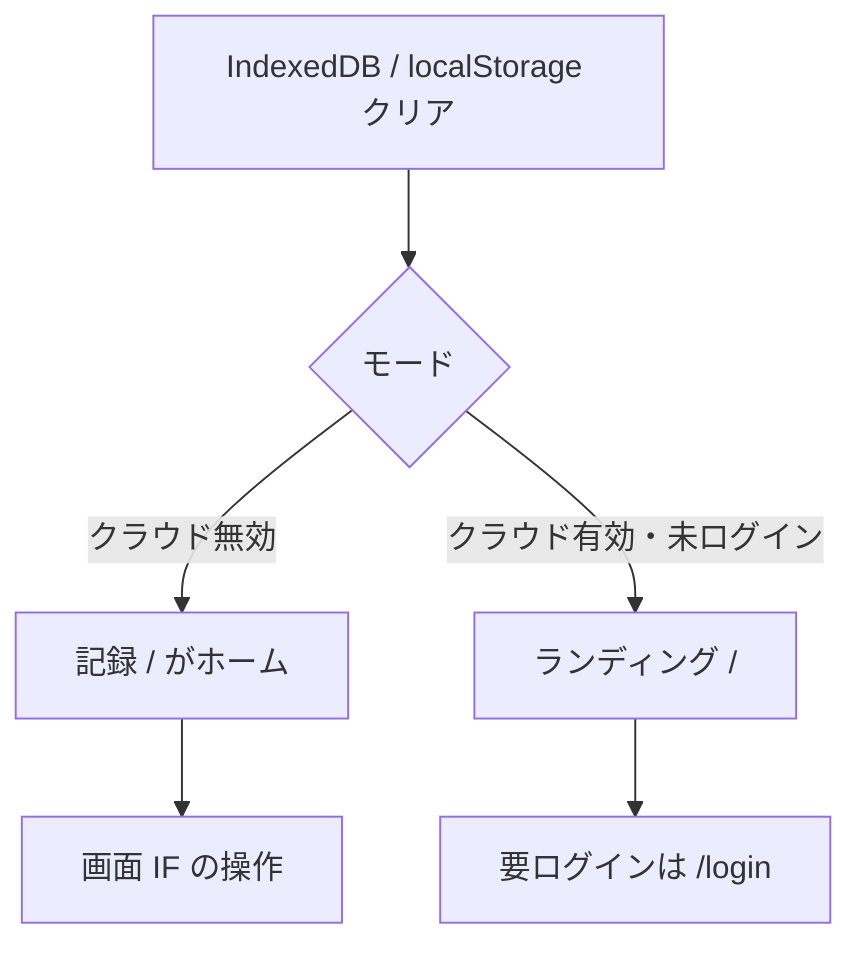

# 画面テスト

[テスト設計](README.md) / [テスト概要](../overview.md) / [テスト IF E2E / MAN](../if.md#4-画面-e2e)

Playwright を想定。操作とメッセージは [画面 IF](../../screens/if.md)、遷移は [画面設計](../../screens/design/README.md)。

---

## モード

クラウド同期の有無でルートが変わる（[認証ゲート](../../screens/design/README.md#認証ゲート)）。E2E はモードを明示する。

| モード | 設定 | 使う場面 |
|--------|------|----------|
| クラウド無効 | `VITE_API_URL` または Cognito 設定を空 | 記録・タックル・単位。Docker 不要 |
| クラウド有効 | ローカル API + テスト用 JWT（または API スタブ） | 同期、履歴のクラウド往復、要ログインゲート |
| 手動 | 開発用 Cognito | 登録・ログイン・メール変更・退会の実画面 |

E2E で Cognito の Hosted UI やメール確認コードは扱わない。認証画面の入力エラー（必須、規約未同意、パスワード不一致）はクラウド有効かつモックした Auth でもよいが、優先度は記録フローより下。実ログインは MAN。

---

## 前提

ケース前:

- IndexedDB `fissingplotter` を削除
- `localStorage`（単位、同期キー）を削除
- GPS は開発フォールバック、または Playwright の geolocation モック（[ローカル開発](../../_archive/2026-08-28/local-dev.md)）

ビューポートはスマホ幅（画面 IF の `max-w-md` を意識。例: 390×844）。

---

## 対象

優先は記録が壊れないこと。タックル・図鑑・単位は端末のみなのでクラウド無効 E2E で足りる。

| 画面 | モード | 観点 | IF |
|------|--------|------|-----|
| SCR-01 ランディング | 有効・未ログイン | 「無料ではじめる」「ログイン」 | [E2E-01](../if.md#e2e-01-ランディング) |
| 認証ゲート | 両方 | 無効なら `/history` も通る。有効・未ログインなら `/login` | [E2E-02](../if.md#e2e-02-認証ゲート) |
| SCR-06 記録 | 無効 | 空のまま保存できる。GPS 失敗でも保存。体長負・匹数 0 はエラーで残る | [E2E-03](../if.md#e2e-03-記録保存) |
| SCR-06 タックル | 無効 | パネル、マイタックル適用、保存後クリア / 「次回も使う」 | [E2E-04](../if.md#e2e-04-記録タックル) |
| SCR-07〜09 | 無効 | 空状態、カード→詳細→編集→削除。期間ゼロ件 | [E2E-05](../if.md#e2e-05-履歴) |
| SCR-11 | 無効 | 追加・コピー・削除。空バリデーション | [E2E-06](../if.md#e2e-06-マイタックル) |
| SCR-12 / 13 | 無効 | 魚種なしは出ない。合計は魚種数と釣果数。カードから詳細。写真付きは代表画像。検索で一覧だけ絞る | [E2E-07](../if.md#e2e-07-魚種図鑑) |
| SCR-10 単位 | 無効 | 表示だけ変わる。保存値は cm/g | [E2E-08](../if.md#e2e-08-単位) |
| 同期 | 有効 | 保存が API に載る。再読込後も履歴にある。削除はリロード後も戻らない | [E2E-09](../if.md#e2e-09-クラウド同期) |
| オフライン保存 | 有効 | オフラインでも端末に残る。失敗してもフォームは残る | [E2E-10](../if.md#e2e-10-オフライン) |
| COM-02 | ログイン後 | 記録 / 履歴 / マイ図鑑 / マイページ。公開ページでは出ない。COM-01 はクラウド有効時のログイン表示 | [E2E-11](../if.md#e2e-11-シェル) |
| SCR-17〜19 | どちらでも | 表示。戻る先 | [E2E-12](../if.md#e2e-12-静的ページ) |

写真（COM-03）のカメラ実機は MAN。E2E はファイル選択で JPEG を渡せるところまで。

天気・潮位の失敗は記録を止めない（仕様）。E2E クラウド有効では API を 500 にして保存成功を見る。

---

## 手動

自動にしにくいもの。開発スタック（`npm run dev` + `dev:api`）と開発用 Cognito。

| 領域 | 観点 | IF |
|------|------|-----|
| SCR-02〜05 | 登録、確認コード、ログイン、パスワード再設定 | [MAN-01](../if.md#man-01-cognito認証) |
| SCR-14〜16 | メール変更、パスワード変更、退会（実 Pool） | [MAN-02](../if.md#man-02-アカウント) |
| COM-03 | カメラ、アルバム、端末保存 | [MAN-03](../if.md#man-03-写真) |
| API-07〜09 | 実キーで気温・地名・潮位が入る。キーなしでも記録は保存 | [MAN-04](../if.md#man-04-環境データ) |
| PWA | インストール、オフライン再訪で記録画面が開く | [MAN-05](../if.md#man-05-pwa) |
| オフライン後の同期 | ログイン済みオフラインの未送信件がクラウドへ載る。空の端末ではクラウドの件と削除ログを取り込む | [MAN-06](../if.md#man-06-オフライン後の同期) |
