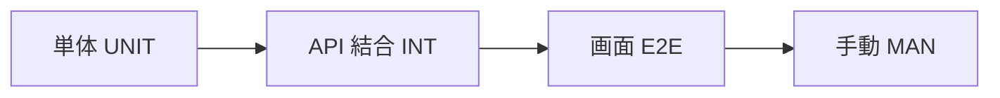
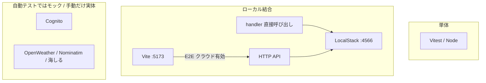

# テスト概要

cast mark のテストは、画面 IF・API IF を正として、**本番 AWS と分離したローカル**で仕様どおり動くことを確認する。いま自動テストは無い。本資料はこれから作るローカル検証の見取り図。

| 次に読む | 内容 |
|----------|------|
| [テスト設計](design/README.md) | 方針・環境・層・実行の流れ |
| [テスト IF](if.md) | ケース ID・前提・期待結果 |

仕様の正は [画面 IF](../screens/if.md) / [API IF](../api/if.md)。ローカル開発の起動は [`docs/_archive/2026-08-28/local-dev.md`](../_archive/2026-08-28/local-dev.md)（現行の開発スタック。テストもこれを流用する）。

---

## 役割

記録の正は端末（IndexedDB）。クラウドはログイン時の同期先。テストもこの前提で、次を分けて見る。

- **端末だけ**（クラウド無効）でも記録・履歴・タックルが使える
- **オンラインかつログイン**なら API と同期する
- 天気・場所名・潮位が取れなくても記録自体は止めない
- 自分の記録だけ見える。退会後は API が 403

本番デプロイ・負荷・セキュリティ監査は当面の対象外。

---

## 層

| 層 | 何をするか | Docker | 設計 | IF |
|----|------------|--------|------|-----|
| 単体 UNIT | 純関数・バリデーション。I/O なし | 不要 | [単体](design/unit.md) | [UNIT](if.md#2-単体-unit) |
| API 結合 INT | Lambda handler + LocalStack。外部 API はモック | LocalStack のみ | [API](design/api.md) | [INT](if.md#3-api-結合-int) |
| 画面 E2E | ブラウザから画面 IF の操作を辿る | クラウド有効時のみ | [画面](design/screens.md) | [E2E](if.md#4-画面-e2e) |
| 手動 MAN | Cognito 実体・外部 API 実体・カメラ / PWA | 開発スタック | [画面](design/screens.md#手動) | [MAN](if.md#5-手動-man) |

SAM local（Lambda in Docker）は開発時の手動確認用。自動テストの主経路にはしない（起動が重い）。

---

## 環境

本番とデータを混ぜない。既存のローカル開発と同じ LocalStack を使う。

| 項目 | 自動テスト | 手動 |
|------|------------|------|
| Lambda | handler をプロセス内で呼ぶ | `npm run dev:api`（SAM local） |
| DynamoDB / S3 | LocalStack | 同じ |
| 認証 | `LOCAL_DEV` で JWT の `sub` を読む。署名検証しない | 開発用 Cognito User Pool |
| 天気・場所・潮位 | fetch モック | 実キー |
| フロント | Playwright。クラウド無効なら API なし | `npm run dev` |

詳細は [テスト設計 環境](design/README.md#環境)。
